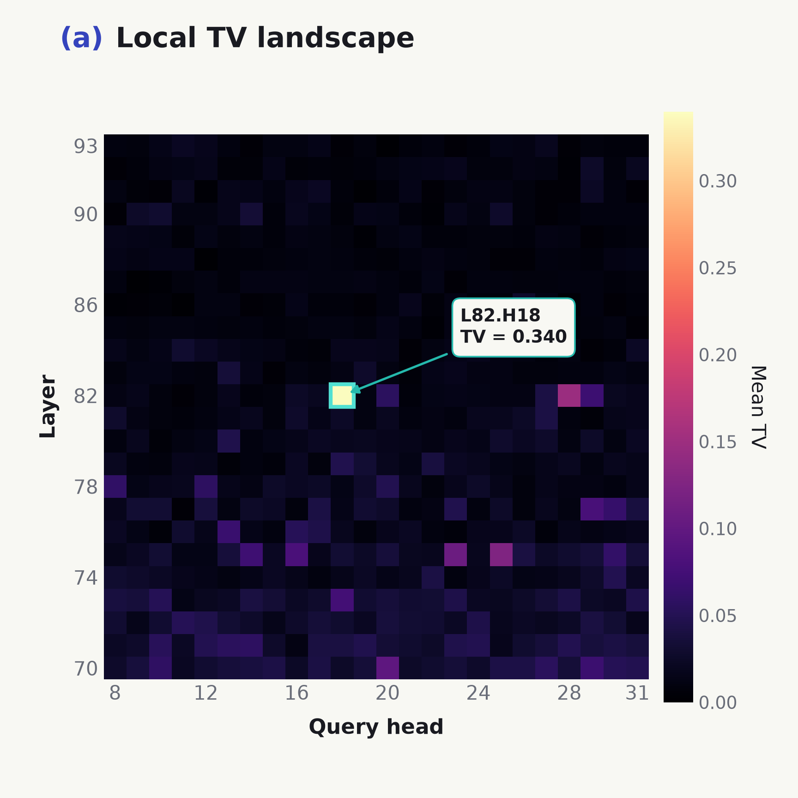
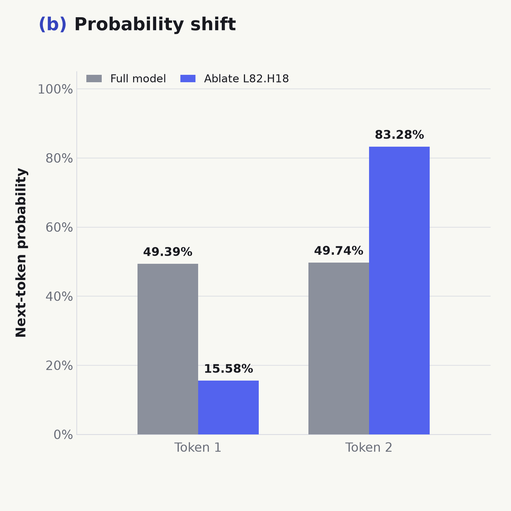
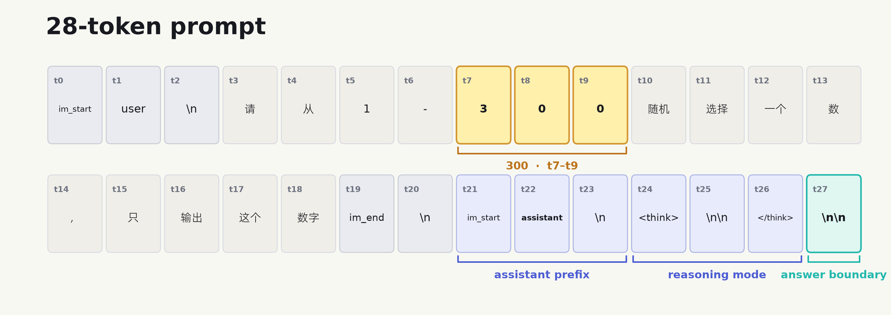
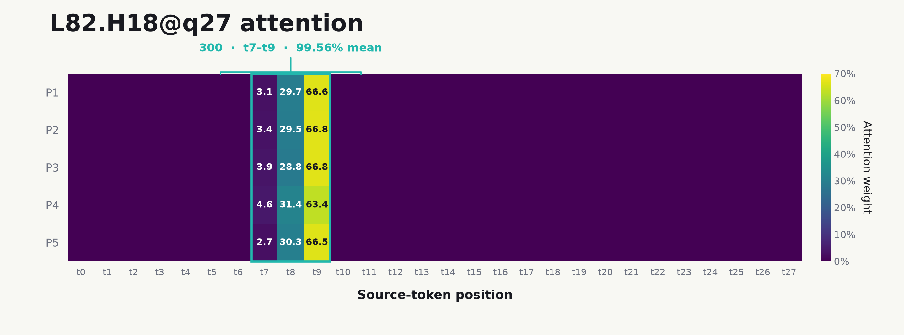
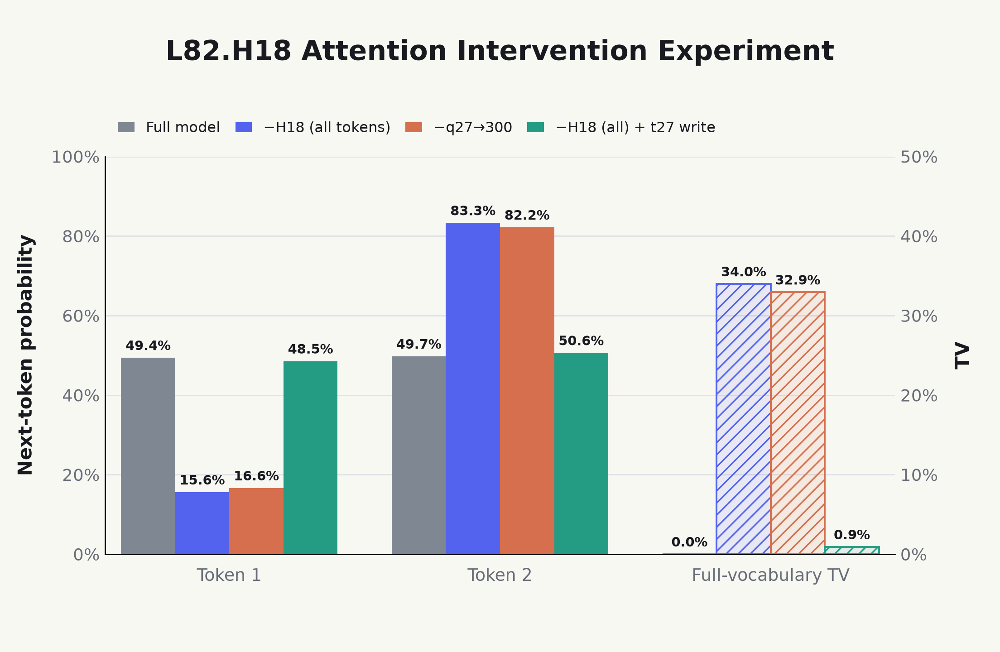
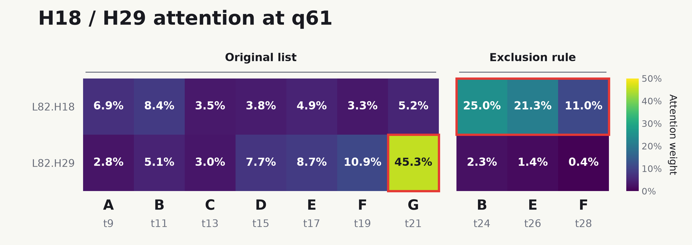
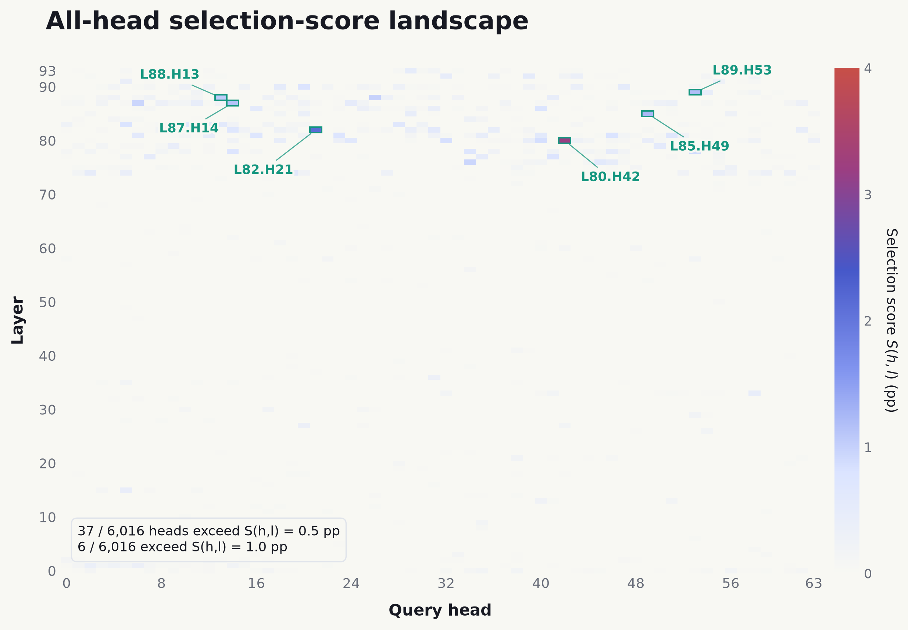
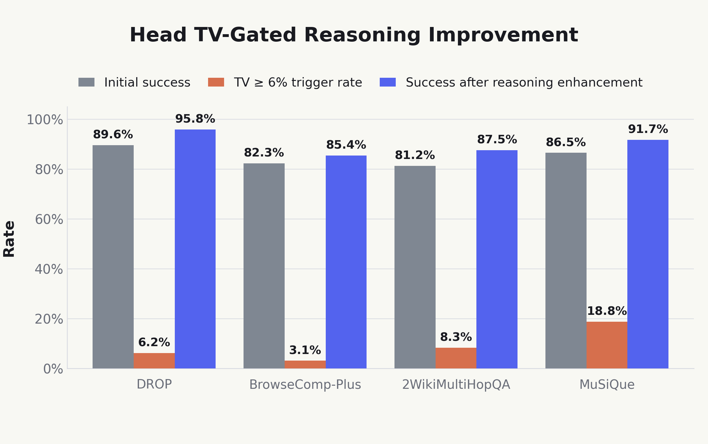
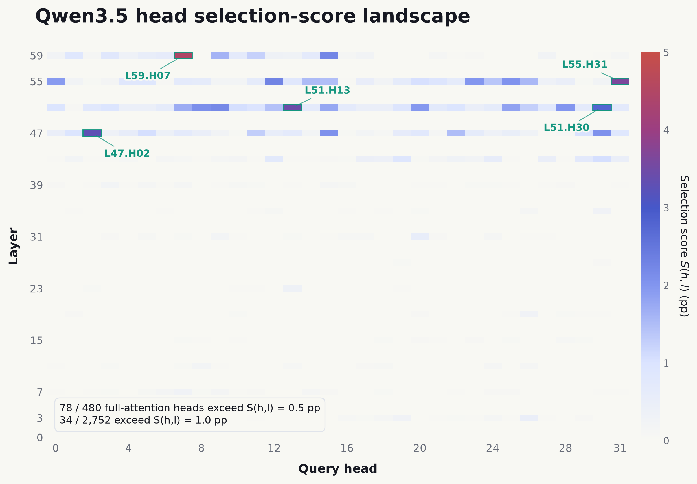
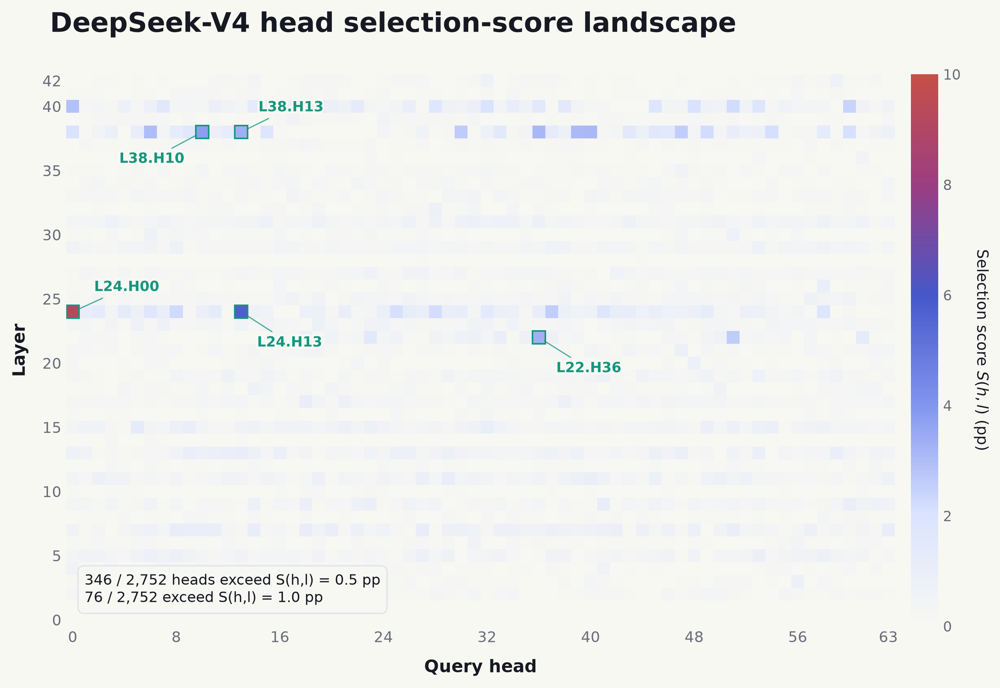

From a Model’s Random-Number Fingerprint:\
A Study of LLM Reasoning Circuits
==========================================

Author

Published

September 22, 2026

Discussions about GPT “getting worse” or being routed to a smaller model never really stop. A [LINUX DO post](https://linux.do/t/topic/2472419) proposed a simple test: repeatedly ask a model to choose a random number from a fixed range, estimate its output distribution, and use that distribution as a statistical fingerprint of the model¹.

Note 1

Since the release of Astra, a more popular test seems to be the pelican-riding-a-bicycle prompt; see this [LINUX DO post](https://linux.do/t/topic/2858863).

It is easy to see why this method works and why it is useful. But it also suggests a more interesting research question:

**How is this random-number fingerprint written or generated inside the model?**

To investigate this question, we began with the prompt **「在 1–300 中随机选择一个数」**(English translation: ***“Choose a random number from 1 to 300”***) and located a class of heads that strongly read the candidate-range boundary `300` ([**Sec 2**](#the-head-that-writes-the-random-number-fingerprint)). Further experiments gradually revealed their more general role: reading the candidate set in a reasoning task. When the answer has not yet been successfully inferred and the model must still choose among candidates, the information these heads write into the residual stream markedly changes the output ([**Sec 3**](#sec-head-generalization)).

When we manually interrupt the model’s reasoning circuit during otherwise normal reasoning—for example, by deleting a key reasoning chain or blocking retrieval heads—and thereby force the model into uncertain reasoning, the causal effects of these heads are likewise amplified ([**Sec 4**](#sec-candidate-circuit-interventions)). **This suggests that two circuits compete inside the model: when the model can reason normally, the reasoning circuit operates while the circuit corresponding to these heads is suppressed;when the reasoning circuit is interrupted, this other circuit gains causal influence and begins to dominate the model’s behavior.**

Based on this, we use the behavior of these heads as a signal of whether the model’s reasoning is reliable and trigger a reasoning-enhancement strategy when unreliable reasoning is detected. The results show that it can indeed detect unreliable reasoning and improve model performance ([**Sec 5**](#sec-tv-triggered-repair)). Additional experiments show that these heads also exist in models with linear-attention and sparse-attention architectures ([**Sec 6**](#sec-attention-architecture-generalization)).

**If this question interests you, read on. The complete post will take about 30 minutes.**

## 1 Background: Non-random Outputs from LLMs

Suppose we give a language model the following prompt:

请从 1–300 随机选择一个数，只输出这个数字。

(English translation: ***“Choose a random number from 1 to 300. Output only the number.”***)

The model does not literally draw a random number during its forward pass. More precisely, a language model’s forward pass is a deterministic function from the input text to the logits for the next token. The decoder then uses a temperature T to turn those logits into a probability distribution:

p_i = \frac{\exp(z_i/T)}{\sum_j \exp(z_j/T)}.

With both the prompt and decoding configuration fixed, the model’s next-token probability distribution p is fixed as well².

Under sampling, a pseudorandom number generator selects a token from the distribution p. Individual outputs can vary, while the long-run statistical distribution should remain stable. This is why random-number choice can serve as a model fingerprint: different parameter sets assign different but stable probabilities to number tokens, and repeated sampling turns those preferences into a recognizable output distribution.

Note 2

Real inference services are not necessarily reproducible bit for bit. Batching and parallel reductions in backends such as vLLM and SGLang can change the order of floating-point operations and introduce numerical differences. See Thinking Machines Lab’s [Defeating Nondeterminism in LLM Inference](https://thinkingmachines.ai/blog/defeating-nondeterminism-in-llm-inference/).

The question we really care about is: **How is this probability distribution written and generated during the model’s forward pass?**

## 2 The Head That Writes the Random-Number Fingerprint

During an LLM forward pass, QK determines where attention reads from, while OV determines what is written into the residual stream. That information is read and processed by MoE layers before the output layer produces a logit distribution.

Under this picture, a reasonable hypothesis is that some deep-layer heads encode the range `1–300`, so downstream computation can read the candidate range. That information is written into the residual stream and shapes the output; the model’s selection preference is written along the way.

To test this hypothesis, we ran experiments on the MoE model [Qwen3-235B-A22B](https://huggingface.co/Qwen/Qwen3-235B-A22B). We constructed multiple Chinese prompts similar to 「请从1-300随机选择一个数，只输出这个数字」 (English translation: ***“Choose a random number from 1 to 300. Output only the number.”***). All ask the model to select a random number from `1–300`, but use different semantic phrasings.

The exact probabilities vary across prompts, but their overall structure remains stable: almost all next-token probability mass is assigned to digits, and `1` and `2` consistently form the dominant competition³.

Note 3

I suspect that the high probability of `1` and `2` relative to other digits reflects the numerical distribution in the pretraining corpus. The pronounced preference between `1` and `2`, however, seems more likely to be encoded during post-training.

|  P(1)  |  P(2)  | P(3\text{–}9) | P(\text{digit}) |
|:------:|:------:|:-------------:|:---------------:|
| 49.39% | 49.74% |     0.73%     |     99.86%      |

We therefore use “which head most strongly disrupts this generation preference?” as the criterion for locating the key head.

### 2.1 Head localization

[Qwen3-235B-A22B](https://huggingface.co/Qwen/Qwen3-235B-A22B) has 94 layers and 64 query heads per layer. We examined each head through ablation: immediately before the layer’s attention `o_proj`, we zeroed the target head’s 128-dimensional output slice at every input-token position while leaving all other computation unchanged.

We measured the change between the original and ablated full-vocabulary distributions with total variation distance:

\operatorname{TV}(h,l) =\operatorname{TV}\\\left(p,p^{(h,l)}\right) =\frac{1}{2}\sum\_{v\in\mathcal V} \left\|p(v)-p^{(h,l)}(v)\right\|.

Here, p is the original next-token distribution, while p^{(h,l)} is the distribution after ablating head (h,l). A larger TV means that the head has a stronger causal effect on the current output distribution.

We identified `L82.H18` as the most significant head. Its full-vocabulary TV reached **34.0%**, the strongest effect among all heads⁴.

Note 4

`L82.H18` also ranks first by centered full-vocabulary logit \operatorname{RMS}\_{c}(h,l), defined as:

\operatorname{RMS}\_{c}(h,l)= \sqrt{\frac{1}{\|\mathcal V\|}\sum\_{v\in\mathcal V} \left(\Delta z_v^{(h,l)}-\overline{\Delta z}^{(h,l)}\right)^2}.

Here, \Delta z_v^{(h,l)} is the change in token v’s logit after ablating head (h,l), and \overline{\Delta z}^{(h,l)} is its full-vocabulary mean. \operatorname{RMS}\_{c}(h,l) represents the overall effect of ablating that head on the full-vocabulary logit structure.

Figure 1(a): Local TV landscape around `L82.H18`.

Figure 1(b): Changes in P(1) and P(2) after ablating `L82.H18`.

After ablating `L82.H18`, P(1) decreased for every prompt, with a mean change of **−33.80** percentage points; meanwhile, P(2) changed by an average of **+33.54** percentage points, while the remaining output probabilities were nearly unchanged.

This shows that the identified `L82.H18` does indeed write a strong preference within the set of numerical candidates.

### 2.2 Head attention distribution

We next examine the attention distribution of `L82.H18`. All prompts used here contain 28 tokens and share a similar structure: `300` is split across t7–t9, the model-side `assistant` token is at t22, and the final `\n\n` before the answer is at t27.

Figure 2: The 28-token random-number prompt after applying the chat template.

The most concentrated attention connection of `L82.H18` runs from token `\n\n` at t27 to token `300` at t7–t9, with an average attention mass of **99.56%**. The figure below shows the attention distributions for five representative prompts.

Figure 3: `L82.H18@q27` attention across five representative prompts. Each row represents one prompt, each column a token position, and token `300` always occupies t7–t9.

In other words, as the model prepares its answer, `L82.H18` reads almost exclusively from the range boundary `300` and writes the resulting vector at the start of the answer.

### 2.3 Head attention intervention

To determine whether the prominent attention edge actually dominates the output shift, we performed the following `L82.H18` attention interventions on the same prompts:

- **Full model**: no intervention; this is the baseline.
- **Remove `L82.H18`**: zero the output of `L82.H18` at every token position.
- **Remove the `\n\n → 300` attention edges**: zero only the three edges from q27 to t7–t9.
- **Remove `L82.H18`, then restore the `\n\n → 300` write**: first remove `L82.H18`, then add back at t27 the original residual-write vector contributed predominantly by t7–t9; the other token positions remain ablated.

The first three experiments test whether the `\n\n → 300` attention edges dominate the behavior of `L82.H18`. The fourth restores the information these edges write into the residual stream, testing whether it recovers the effect of the complete head.

Figure 4: The probabilities of generating tokens `1` and `2`, and full-vocabulary TV, under four conditions: full model, remove L82.H18, remove \n\n → 300 attention edges, and remove L82.H18 then restore the \n\n → 300 write.

The results show that removing the `\n\n → 300` attention edges reaches **96.95%** of the effect of removing the complete `L82.H18` head. After removing `L82.H18`, restoring only the residual write dominated by these edges recovers **97.33%** of the original deletion effect.

This suggests that the main role of `L82.H18` is to transport candidate-range information to the answer position and thereby help form the model’s output fingerprint.

## 3 Head Generalization Experiments

So far, we have demonstrated the behavior of `L82.H18` when choosing a random number from 1 to 300. The next question is how well this behavior generalizes: can `L82.H18` aggregate and transport candidate information to help form a model fingerprint in other tasks, and can it serve a more general function?

To answer this question, we varied candidate types and constraints, downstream tasks, and reasoning length to examine the head’s function across settings.

### 3.1 Candidate-Type Generalization Experiments

We began with the most direct generalization: if numerical candidates are replaced by another type of candidate, does `L82.H18` exhibit the same properties? We replaced the original `1–300` range with an alphabetic range:

请从 A 到 D 中任选一个，只输出这个字母。

(English translation: ***“Choose any letter from A to D and output only that letter.”***)

The result closely mirrors the numerical-range experiment: `L82.H18` assigns **88.62%** attention to the letter `D`, and deleting this prominent attention edge produces **30.3%** TV.

We then expanded the candidates into explicit lists to test whether this property extends to general candidate sets. Every experiment used the same template:

请从候选列表【……】中任选一个，只输出被选中的候选。

(English translation: ***“Choose any item from the candidate list 【…】 and output only the selected item.”***)

We constructed a range of candidate lists, including canonical and non-canonical lists.

- **Canonical lists**: the elements have a strong intrinsic order and are presented in that order, such as the heavenly-stem list 【甲, 乙, 丙, 丁, …】.
- **Non-canonical lists**: the elements have no stable intrinsic order and are arranged without a canonical sequence, such as the food list 【dumplings, noodles, rice, buns, …】.

| List type | Attention to final list item | Total candidate attention | TV after removing list-attention edges |
|----|---:|---:|---:|
| **Canonical lists** | 24.09% | 75.60% | 7.2% |
| **Non-canonical lists** | 6.56% | 41.89% | 2.7% |

The results show that `L82.H18` has a substantially stronger effect on canonical lists: it assigns more attention to them, and removing its attention edges to the list produces greater TV than for non-canonical lists⁵.

Note 5

The more salient or familiar a list’s ordering relation is, the stronger the effect of `L82.H18`. For example, the numerical list `[1, 2, 3, 4]` produces a stronger effect than the seasonal list `[spring, summer, autumn, winter]`.

We further investigated whether this behavior depends on the elements’ intrinsic ordering or requires them to be presented in order. We completely reversed each list and constructed several shuffled arrangements, then observed `L82.H18`.

| List type | Arrangement | Attention to final list item | Total candidate attention | TV after removing list-attention edges |
|----|----|----|----|----|
| **Canonical lists** | Reversed | 11.27% | 62.43% | 4.8% |
|  | Shuffled | 17.07% | 68.90% | 8.2% |
| **Non-canonical lists** | Reversed | 10.65% | 44.76% | 2.6% |
|  | Shuffled | 7.54% | 44.40% | 2.5% |

Overall, list order has little effect. For non-canonical lists, attention and TV remain essentially unchanged regardless of order. Among canonical lists, only complete reversal produces a noticeable decline in TV; attention and TV otherwise stay relatively high across arrangements. This suggests that `L82.H18` can recognize a candidate set’s strict intrinsic order rather than relying only on the order in which the list appears in the prompt.

### 3.2 Candidate-Constraint Generalization Experiments

Next, we examine generalization across candidate constraints: when we add constraints to the candidate set and change the set of allowed choices, **does `L82.H18` shift its attention to the constraint information that defines that set?** We first run a simple experiment, retaining the original `1–300` range while additionally requiring the selected number to be less than `150`:

请从1-300中小于150的数里随机选择一个，只输出这个数字

(English translation: ***“Randomly choose a number less than 150 from the range 1–300. Output only that number.”***)

At the final answer position, `L82.H18` assigns **83.42%** attention to `150` in the added constraint, while its attention to `300` falls to **9.07%**. Removing this head’s write at the final answer position produces **44.4%** TV.

We then extend the experiment to the different canonical-list types in [**Sec 3.1**](#candidate-type-generalization-experiments). For each list, we construct multiple allowed subsets and explicitly specify the set available in the current task using the following fixed template:

候选全集为【…】。本次允许集合为【…】。请从允许集合中随机选择一项，只输出答案

(English translation: ***“The full candidate set is 【…】. The allowed set for this task is 【…】. Randomly select one item from the allowed set and output only the answer.”***)

We separately measure the attention that `L82.H18` assigns at the final answer position to the restated allowed set and the original full set, and the TV after jointly removing its attention edges to both sets:

[TABLE]

Across list types, `L82.H18` assigns more attention on average to the allowed set than to the original full set, with overall means of **57.06%** and **17.17%**, respectively. This shows that additional constraints do redirect the primary attention of `L82.H18` toward the candidates currently allowed.

We further construct more complex rule-based list-selection tasks. Rather than listing the active candidate set directly, we provide the full list and a filtering rule, asking the model to choose any candidate that satisfies the rule. The bar chart below shows the mean attention of `L82.H18` to the list and rule in each task type, together with the TV after removing the corresponding edges.

Figure 5: Attention and edge-ablation TV for `L82.H18` across six rule-based selection tasks. Solid blue bars show total attention to the list and rule descriptions (left axis), while hatched orange bars show full-vocabulary TV after removing the corresponding attention edges (right axis).

The results are similar to the earlier experiments: `L82.H18` allocates most of its attention to the list and rule descriptions. Removing its attention edges to these positions produces an average TV of **6.2%** across task types.

We also observe functional differentiation among heads. Although the preceding experiments focus on `L82.H18`, it is not the only head with a similar function. For another such head, `L82.H29`⁶, the two heads exhibit different reading emphases: `L82.H18` focuses more on the rule description that defines the candidate range, whereas `L82.H29` focuses more on the final candidate in the original list.

Note 6

This head was localized using a method similar to [**Sec 2.1**](#head-localization). On the `1–300` random-number task, its mean attention to `300` ranks first among all heads, while its centered full-vocabulary logit \operatorname{RMS}\_{c}(h,l) ranks second.

The figure below gives an intuitive example: **「给定有序字母列表【A，B，C，D，E，F，G】。B、E与F均不可选择；请在其余字母中任选一项。只输出所选字母，不要解释。答案：」** (English translation: ***“Given the ordered letter list 【A, B, C, D, E, F, G】, neither B, E, nor F may be selected. Choose any item from the remaining letters. Output only the selected letter, without explanation. Answer:”***). At the same final answer position, `L82.H18` assigns **57.60%** total attention to the constraint tokens (`B/E/F`), while `L82.H29` assigns **45.33%** attention to the final item `G` in the original list.

Figure 6: Attention from the final answer position `q61` for `L82.H18` (top row) and `L82.H29` (bottom row) on the same prompt. Each column is an actual source token: `A–G` from the original list on the left, and the repeated `B/E/F` from the constraint on the right. Original token positions appear below the letters.

### 3.3 Task-Type Generalization Experiments

We next ask whether the behavior of `L82.H18` generalizes to downstream tasks rather than being limited to random selection. We keep the input range fixed at `1–300`, construct a variety of downstream tasks, and observe the head’s behavior. Initial experiments suggest that the head’s effectiveness is related to the number of valid candidates allowed by the task. Specifically, we divide the tasks into two groups:

- **Non-unique tasks**: the task admits multiple valid answers, and outputting any one of those candidates satisfies the task requirements.
- **Unique tasks**: the task has a unique valid answer, and only that candidate satisfies the task requirements.

| Task type | Attention to `300` | TV after removing the `L82.H18` attention edges |
|----|---:|---:|
| **Non-unique tasks** | 92.23% | 13.7% |
| **Unique tasks** | 58.86% | 0.5% |

In both groups, `L82.H18` shows substantial attention to `300`, but only in non-unique tasks does removing the head produce a substantial TV change.

Therefore, `L82.H18` cannot simply be described as a head that operates only in random-selection tasks. It still attends to the candidate range in other tasks, which means it transports range information to the answer position; **yet downstream computation appears to use that information only when the answer has not yet been determined and the model must still distribute probability among multiple candidates.**

We further test this claim. A simple intuition is that if the substantial effect of `L82.H18` indeed arises because “the model remains uncertain about the answer,” then `L82.H18` should also be effective on sufficiently difficult tasks with a unique answer whenever the model cannot infer that answer effectively on its own.

We therefore construct two classes of unique-answer tasks, one **simple** and the other **difficult**. Their wording and length are kept as similar as possible, and, as in the preceding experiments, thinking mode is disabled. We compare their accuracy, list attention, and TV after removing attention edges to the list under ordered and shuffled list conditions.

| Task difficulty | Ordered |  |  | Shuffled |  |  |
|----|----|----|----|----|----|----|
|  | Accuracy | List attention | List-edge TV | Accuracy | List attention | List-edge TV |
| **Simple tasks** | 100.0% | 10.08% | 0.24% | 98.0% | 2.47% | 0.24% |
| **Difficult tasks** | 52.5% | 66.17% | 5.39% | 52.0% | 60.38% | 4.40% |

The results match the prediction. Accuracy on the simple tasks reaches **100%**; attention to the list is low, and list-edge TV is only about **0.24%**. By contrast, accuracy on the difficult tasks is only about **52%**, meaning that the model cannot reason reliably; list attention rises to about **60%**, while list-edge TV reaches **5.39%**. This shows that when the answer has not been effectively inferred, `L82.H18` reads more information from the original list and has a stronger causal effect.

We ran additional tasks of varying difficulty and summarize each task’s success rate and list-edge TV in the scatter plot below. Each point represents one task. As the plot shows, more difficult tasks do indeed exhibit higher TV.

Figure 7: Task success rate and `L82.H18` list-edge TV. The x-axis shows task success rate; the y-axis shows full-vocabulary TV after removing the final-position `L82.H18` attention edges to all list elements.

### 3.4 Generalization to Long-Form Reasoning

We next enable thinking mode to test whether `L82.H18` retains the same properties under long-form reasoning. We select representative tasks spanning multiple success rates from [**Sec 3.3**](#sec-task-type-generalization); the comparison between thinking disabled and enabled is shown below.

| Task | no-think |  |  | think |  |  |
|----|----|----|----|----|----|----|
|  | Accuracy | List attention | List-edge TV | Accuracy | List attention | List-edge TV |
| Closest to endpoint geometric mean | 2.08% | 81.41% | 8.61% | 95.83% | 5.38% | 0.015% |
| Closest odd-position rank mean | 18.75% | 68.54% | 8.06% | 100% | 7.30% | 0.008% |
| Closest to mean rank | 22.92% | 72.08% | 6.93% | 100% | 6.01% | 0.007% |
| Item after the largest rank gap | 29.17% | 71.92% | 5.79% | 100% | 5.28% | 0.011% |
| Earliest canonical even-position item | 43.75% | 55.38% | 3.97% | 97.92% | 4.10% | 0.002% |
| Canonical item 2 | 70.83% | 54.34% | 3.15% | 100% | 11.24% | 0.003% |
| Displayed item 5 | 93.75% | 40.14% | 1.24% | 100% | 4.46% | 0.003% |

With thinking enabled, task accuracy rises to nearly 100%, while list-edge TV falls to almost 0% across all tasks; at the same time, attention assigned to the original list drops sharply. This shows that once the answer has been inferred in thinking mode, the model’s response relies very little on the list information transported by `L82.H18`⁷.

Note 7

Another point worth noting is that the higher a task’s success rate, the less attention `L82.H18` assigns to the list. However, further intervention experiments show that TV is not determined by the amount of list attention: intervening on attention barely affects TV. The two appear instead to be different manifestations of some circuit signal in the model.

Thinking mode, however, inserts a long reasoning trace between the input list and the final answer, so the decline in attention and TV might simply result from the greater distance. To investigate further, we hold the input list and task fixed and construct four strictly length-matched combinations: **no-think** / **forced-think** crossed with **correct information** / **length-matched placeholder**.

- **no-think**: disable thinking mode and pad the input to the target length.
- **forced-think**: retain the `<think>` structure and pad the reasoning segment.
- **correct information**: insert correct input or reasoning information sufficient to determine the answer.
- **length-matched placeholder**: insert task-irrelevant placeholder text of the same length as the correct information.

[TABLE]

The results show that length is not the determining factor: under the length-matched placeholder conditions, list-edge TV remains above **5%**. List attention and TV fall sharply only after reasoning sufficient to determine the answer is added. The change is therefore unrelated to distance or to whether thinking is enabled.

These results further strengthen the argument in [**Sec 3.3**](#sec-task-type-generalization): **only when the answer has not been effectively inferred or determined does the candidate information transported by `L82.H18` substantially affect the output distribution.**

### 3.5 Generalizing Candidate-Information-Transport Heads

The preceding experiments use `L82.H18` as their subject. As noted in [**Sec 3.1**](#candidate-type-generalization-experiments), however, this group of heads has a strong causal effect only when a list has a pronounced internal order.

Do lists with weaker order relations also have a family of heads with a similar function? From the perspective of [Transformer circuits](https://www.transformer-circuits.pub/2023/may-update/index.html), such heads should exist⁸. We therefore test whether comparable heads can be found on general lists.

Note 8

Because the circuit responsible for a function is distributed across multiple layers and heads, a family of heads may perform similar functions while differing in the specific settings in which they become effective or active.

Following the setup of [**Sec 2**](#the-head-that-writes-the-random-number-fingerprint), we construct multiple random unordered candidate lists and run both random-choice and deterministic-choice tasks. We then scan every head in the model, zeroing its output slice immediately before the attention `o_proj`. We define the selection score as

S(h,l)=\max\\\left(\Delta \operatorname{TV}(h,l),0\right)\times A(h,l),

where \Delta \operatorname{TV}(h,l) is the difference in head-ablation \operatorname{TV} between random and deterministic choice, and A(h,l) is attention to the candidate list under random choice. The score requires both candidate-list reading and a causal effect concentrated in the unresolved condition, reducing interference from biases such as syntactic or ICL heads.

The full-model heatmap of S(h,l) is shown below. We select the six highest-scoring heads—`L80.H42`, `L82.H21`, `L85.H49`, `L89.H53`, `L87.H14`, and `L88.H13`—as representative heads.

Figure 8: Full-model heatmap of S(h,l), with the six highest-scoring heads labeled.

Further experiments show that these heads have effects similar to `L82.H18`: while the answer remains unresolved, they read the candidate list and their ablation substantially changes the output distribution;once the answer is determined, their causal effect nearly disappears. To keep the post readable, we do not detail those experiments here. In [**Sec 4**](#sec-candidate-circuit-interventions), we use these more general heads in further experiments to reveal their mechanism and information circuit.

## 4 Causal Effects of Heads Under Reasoning-Circuit Interruption

The experiments in [**Sec 3**](#sec-head-generalization) identified a family of heads with the following function:

**When the answer has not yet been successfully inferred and the model must still choose among multiple candidates,**\
**downstream computation relies strongly on the candidate information transported by these heads.**

This behavior generalizes across candidate lists, constraints on the candidate set, task types, and answers that involve long-form thinking.

We can also view this result through the lens of Transformer circuits. A model’s forward pass is not determined by one signal: multiple circuits write different signals into the residual stream, and those signals jointly shape the output. One useful way to understand their interaction is:

Ordinarily, the strongest signal dominates the model’s behavior. Other signals remain present but are suppressed in the competition. If the dominant circuit weakens or is interrupted, a weaker circuit may gain relative weight and compensate for the missing information. This competition may be especially apparent in larger models whose information representations are more distributed.

From this perspective, the heads we found jointly participate in a circuit: when the model can reason normally, the deterministic reasoning signal dominates, the writes of this circuit have little effect on the final output, and removing them produces little TV;when the normal reasoning signal weakens or its circuit is interrupted, this circuit gains greater causal influence and removing it produces substantially larger TV.

The experiments in [**Sec 3.3**](#sec-task-type-generalization) and [**Sec 3.4**](#sec-long-thinking-generalization) already provide initial support for this account. We now test it with active interventions, using multiple methods to damage the model’s normal reasoning circuit and observing whether the causal effect of the candidate heads grows as expected.

### 4.1 Interrupting the Start of the Circuit: Removing Input Evidence

One direct way to disrupt normal reasoning is to remove the decisive evidence from the input, thereby damaging the start of the reasoning pathway.

We construct counterfactual question-answer cases from [DROP](https://allenai.org/open-data), [BrowseComp-Plus](https://texttron.github.io/BrowseComp-Plus/), [2WikiMultiHopQA](https://github.com/Alab-NII/2wikimultihop), and [MuSiQue](https://github.com/StonyBrookNLP/musique). Each question is rewritten so that the correct answer and other candidates are replaced by randomly generated temporary codes. Neither the spelling nor the numbers in the codes reveal a pattern, preventing the model from answering through parametric memory.

Each case has a **complete-evidence** version and a **missing-evidence** version:

- **Complete evidence**: retain all evidence in the input so the model can reason normally.
- **Missing evidence**: remove the key evidence required for reasoning so the model cannot infer the correct answer.

At the start of the answer, we jointly ablate the writes of the heads selected in [**Sec 3.5**](#sec-cross-head-generalization) and measure the full-vocabulary TV.

| Dataset | **Success rate(complete → missing evidence)** | **Head-ablation TV(complete → missing evidence)** |
|----|---:|---:|
| DROP | **100%**→**7.69%** | **0.64%**→**8.13%** |
| BrowseComp-Plus | **91.92%**→**3.33%** | **1.80%**→**6.15%** |
| 2WikiMultiHopQA | **90.48%**→**0%** | **2.01%**→**6.73%** |
| MuSiQue | **94.44%**→**0%** | **0.13%**→**7.47%** |

All datasets show the same pattern: with complete evidence, the model’s reasoning almost always succeeds and TV after removing the heads is small;after key evidence is removed, the model is almost unable to reason and TV rises substantially. The result matches our expectation: when the beginning of the reasoning circuit is interrupted, the candidate information transported by these heads has a substantial causal effect.

### 4.2 Interrupting the Middle of the Circuit: Removing the Key Reasoning Chain

Next, we remove the key chain in the model’s thinking that makes it possible to infer the answer, then observe how the heads’ causal effects change. This can be viewed as disrupting the middle of the reasoning circuit.

We use the counterfactual datasets from [**Sec 4.1**](#removing-input-evidence) and the heads localized in [**Sec 3.5**](#sec-cross-head-generalization), constructing a **complete-reasoning-chain** version and a **missing-reasoning-chain** version:

- **Complete reasoning chain**: inject multiple segments of agent-style reasoning generated by the model under complete evidence.
- **Missing reasoning chain**: delete one key reasoning path from the reasoning trajectory.

Both versions end with **「我已经完成推理并且已经知道答案」** (English translation: ***“I have finished reasoning and already know the answer”***), after which the model produces the formal answer. We again observe the heads’ effects at the start of the answer.

| Dataset | **Success rate(complete → missing reasoning)** | **Head-ablation TV(complete → missing reasoning)** |
|----|---:|---:|
| DROP | **100%**→**0%** | **1.13%**→**8.43%** |
| BrowseComp-Plus | **100%**→**0%** | **1.10%**→**5.30%** |
| 2WikiMultiHopQA | **100%**→**0%** | **0.91%**→**7.96%** |
| MuSiQue | **100%**→**0%** | **1.45%**→**7.28%** |

After the reasoning path is removed, the model changes from success to failure on every trajectory, and the average TV from removing the candidate heads rises substantially. The result again matches our expectation, showing that when the middle of the reasoning circuit is interrupted, the information transported by the heads gains a more substantial effect.

### 4.3 Interrupting the End of the Circuit: Removing Retrieval Heads

The preceding interventions interrupt the beginning and middle of the reasoning circuit. We now consider its end: keep the question and input evidence intact, but block the retrieval heads responsible for transporting the answer from context⁹. Although the answer evidence remains, the model loses the ability to use it.

Note 9

For the definition and role of retrieval heads, see [Retrieval Head Mechanistically Explains Long-Context Factuality](https://arxiv.org/abs/2404.15574). Some of my recent experiments suggest that, at the end of a reasoning circuit, retrieval heads transport an answer already identified by the model from context to the decoding position.

We first identify the model’s top 20 retrieval heads, about 0.3% of all heads:

`L81.H53`, `L81.H61`, `L79.H52`, `L81.H34`, `L85.H29`, `L79.H59`, `L81.H51`, `L83.H08`, `L61.H51`, `L61.H61`, `L81.H54`, `L76.H39`, `L81.H45`, `L06.H16`, `L79.H63`, `L59.H59`, `L61.H54`, `L82.H25`, `L83.H05`, and `L83.H10`.

Let R denote these retrieval heads and C the previously identified candidate-information heads. We compare four conditions: the intact model `full`, removal of only the retrieval circuit `−R`, removal of only the candidate circuit `−C`, and removal of both `−R``−C`.

We again use the counterfactual datasets from [**Sec 4.1**](#removing-input-evidence), retaining only trajectories answered correctly under `full` but incorrectly under `−R`. For each trajectory, we examine three TV quantities:

- \operatorname{TV}(\mathit{full},\color{#b84949}{-R}) measures the effect of removing retrieval heads. Because the model changes from successful reasoning to failed reasoning, we expect this TV to be very large.
- \operatorname{TV}(\mathit{full},\color{#4857d6}{-C}) measures the effect of removing candidate-information heads. Because the intact reasoning circuit determines the answer, we expect this TV to be small.
- \operatorname{TV}(\color{#b84949}{-R},\color{#b84949}{-R}\color{#4857d6}{-C}) measures the effect of removing candidate-information heads after the reasoning circuit has been interrupted. We expect this TV to be substantially larger than \operatorname{TV}(\mathit{full},\color{#4857d6}{-C}).

| Dataset | \operatorname{TV}(\mathit{full},\color{#b84949}{-R}) | \operatorname{TV}(\mathit{full},\color{#4857d6}{-C}) | \operatorname{TV}(\color{#b84949}{-R},\color{#b84949}{-R}\color{#4857d6}{-C}) |
|----|---:|---:|---:|
| DROP | **65.51%** | **2.44%** | **7.46%** |
| BrowseComp-Plus | **41.13%** | **2.38%** | **17.16%** |
| 2WikiMultiHopQA | **54.41%** | **1.87%** | **10.48%** |
| MuSiQue | **34.43%** | **2.71%** | **5.04%** |

The results match our expectation. \operatorname{TV}(\mathit{full},\color{#b84949}{-R}) is very large on every dataset. After the retrieval heads are blocked, candidate-information-head TV rises substantially, by between **2.33%** and **14.78%**. These results show that after the dominant endpoint of the reasoning circuit is interrupted, the information transported by the candidate heads gains a more substantial effect.

Overall, these experiments further reveal competition among circuits: when the normal reasoning circuit is strong, the signal represented by the candidate heads is suppressed;when the reasoning circuit fails, the candidate-head circuit affects the output more strongly.

## 5 Improving Reasoning by Detecting Head TV

The preceding experiments clarify the function of the candidate-information heads: **when the answer has not been effectively inferred, their effect on the output distribution grows substantially.** Can we use this mechanism to improve the model’s reasoning performance? Specifically, can we enhance performance as follows?

**After normal reasoning produces an answer, measure the candidate heads’ TV,**\
**and, if TV exceeds a threshold, spend additional resources to strengthen reasoning.**

We again test on [DROP](https://allenai.org/open-data), [BrowseComp-Plus](https://texttron.github.io/BrowseComp-Plus/), [2WikiMultiHopQA](https://github.com/Alab-NII/2wikimultihop), and [MuSiQue](https://github.com/StonyBrookNLP/musique), constructing an agent-style workflow in which the model reasons from retrieved information. After reasoning ends and the answer is produced, we ablate the heads’ writes at the position where the final response begins and measure the full-vocabulary TV¹⁰.

Note 10

Because intervention is required only at the final `\n\n` position before the formal answer, all preceding tokens can reuse the prefix cache, keeping TV detection inexpensive. In our implementation, vLLM’s `llm.collective_rpc()` calls `set_rag_tv_probe()` on each worker to switch candidate-head ablation on and off.

Based on the results in [**Sec 4**](#sec-candidate-circuit-interventions), we empirically fix the TV threshold at **6%**. When TV exceeds this threshold, the agent continues the workflow, supplies the model with more retrieved information, and appends a new user prompt stating that the previous output may lack evidence and asking the model to continue reasoning and determine the answer.

Figure 9: Head-TV-gated reasoning enhancement on each dataset, showing the baseline reasoning success rate, frequency of TV exceeding the threshold, and success rate after reasoning enhancement.

Across all four datasets, TV detection identifies trajectories that have not been reasoned through effectively, and reasoning enhancement improves success rates. TV detection can therefore serve as a proxy for unreliable reasoning and provide a degree of repair.

An important qualification is that the method can detect only unreliable reasoning in which the model has not formed a stable internal reasoning circuit;reasoning that the model considers reliable but that is in fact wrong cannot be detected through TV.

Trajectory A **Detected**

**Dataset** · **ID**  
MuSiQue · `4hop2__567956_39078_8987_8974`

Question  
Country B was the only communist country to have an embassy where?

Ground truth  
Alfredo Stroessner's Paraguay

Model’s reasoning  
“Given the available evidence, the answer might be Confederate Gen. John Bell Hood.”

Head TV**9.55%**

**Outcome:** The model guessed incorrectly and its reasoning was uncertain. High TV triggered additional reasoning, which produced the correct answer.

Trajectory B **Missed**

**Dataset** · **ID**  
DROP · `2e82b6a6-8afa-4c30-8bf7-8bd101f9e16e`

Question  
Which team scored more touchdowns in the fourth quarter?

Ground truth  
Chargers

Model’s reasoning  
“The Panthers had two touchdowns, by Gamble and Rosario, so the answer should be the Panthers.”

Head TV**3.17%**

**Outcome:** The model confidently gave a wrong answer. TV did not reach the threshold, so no extra reasoning was triggered.

These two real trajectories illustrate this boundary. In trajectory A, the model’s reasoning already contains signs of guessing, and TV exceeds the threshold, so it is detected and successfully triggers enhanced reasoning. In trajectory B, the model forms a complete and definite reasoning chain; although the answer is wrong, TV does not reach the threshold and the error is missed¹¹.

Note 11

Even so, experiments show that reasoning trajectories like B still have substantially higher TV than reliable and correct trajectories. This suggests that some unreliable or uncertain signals, although absent from the model’s natural-language output, still alter the representation space and can therefore be detected through TV.

Candidate-information-head TV can therefore be viewed as a proxy for unreliable reasoning. **Of course, unreliable signals may also appear in the model’s reasoning chain, but TV can additionally detect signals that are not expressed in natural language (as described in** [**Note 11**](#note-tv-implicit-uncertainty)**). Other measures, such as the distribution entropy of generated tokens, can also capture related signals, but these token-level metrics are local proxies and cannot identify uncertainty across the full reasoning process as TV can.**

[TABLE]

We also measure computation cost. Across all results, reasoning enhancement uses an additional **11.1%** in tokens and **14.9%** in time while improving performance by an average of **5.2 percentage points**. Head-TV detection itself takes only about **1.9 s** per trajectory on average. The additional cost remains somewhat high, but TV detection itself is lightweight.

Taken together, the experiment shows that candidate-head TV can be transformed from a mechanistic-analysis metric into a practically useful reasoning-gating signal. It does not directly generate a more accurate answer; rather, it **helps an agent system decide when reasoning is unreliable and when subsequent reasoning should be enhanced to obtain a more trustworthy result.**

## 6 Head Generalization Across Attention Architectures

The preceding experiments all use the standard-attention model [Qwen3-235B-A22B](https://huggingface.co/Qwen/Qwen3-235B-A22B). We next show that the same kind of heads also exists in the linear-attention model [Qwen3.5-397B-A17B](https://huggingface.co/Qwen/Qwen3.5-397B-A17B) and the sparse-attention model [DeepSeek-V4-Flash-0731](https://huggingface.co/deepseek-ai/DeepSeek-V4-Flash-0731). To keep the post readable, we present only the head-localization results from [**Sec 3.5**](#sec-cross-head-generalization) and the change in head effects after removing the reasoning chain, as in [**Sec 4.2**](#removing-the-key-reasoning-chain); the experimental setups are otherwise unchanged.

### 6.1 Linear-Attention Architecture

[Qwen3.5-397B-A17B](https://huggingface.co/Qwen/Qwen3.5-397B-A17B) uses a hybrid architecture combining linear attention and full attention. The model has 60 layers, 15 of which use full attention. We scan all 480 heads in those full-attention layers; the results are shown below.

Figure 10: Heatmap of S(h,l) for the heads in the full-attention layers of Qwen3.5-397B-A17B, with the five highest-scoring heads labeled.

We select the five highest-scoring heads (`L59.H07`, `L55.H31`, `L51.H13`, `L47.H02`, and `L51.H30`) and compare the TV from deleting these heads under **complete reasoning chains** and **missing reasoning chains**:

| Dataset | **Success rate(complete reasoning → missing reasoning)** | **TV from deleting heads(complete reasoning → missing reasoning)** |
|----|---:|---:|
| DROP | **100%**→**0%** | **3.07%**→**8.64%** |
| BrowseComp-Plus | **100%**→**0%** | **2.99%**→**8.89%** |
| 2WikiMultiHopQA | **100%**→**0%** | **2.54%**→**6.44%** |
| MuSiQue | **100%**→**0%** | **2.40%**→**5.93%** |

After the key reasoning chain is removed, TV rises on every trajectory. This shows that **although most layers of the model use linear attention, heads that transport candidate information still exist in its full-attention layers.**

### 6.2 Sparse-Attention Architecture

[DeepSeek-V4-Flash-0731](https://huggingface.co/deepseek-ai/DeepSeek-V4-Flash-0731) uses the DeepSeek Sparse Attention (DSA) architecture. The model has 43 layers: the first two use sliding-window attention, followed by 21 Compressed Sparse Attention (CSA) layers alternating with 20 Heavily Compressed Attention (HCA) layers. The main attention branch in every CSA and HCA layer contains 64 heads, and every CSA layer additionally contains 64 Indexer heads. We scan only the 2,752 main-attention heads across all layers. As the heatmap below shows, the higher-scoring heads all come from the CSA layers with 4× compression:

Figure 11: Heatmap of S(h,l) for the main-attention heads of DeepSeek-V4-Flash-0731, with the five highest-scoring heads labeled.

We select the five highest-scoring heads (`L24.H00`, `L24.H13`, `L38.H10`, `L38.H13`, and `L22.H36`) and compare the TV from deleting these heads under **complete reasoning chains** and **missing reasoning chains**:

| Dataset | **Success rate(complete reasoning → missing reasoning)** | **TV from deleting heads(complete reasoning → missing reasoning)** |
|----|---:|---:|
| DROP | **100%**→**7.69%** | **0.25%**→**4.90%** |
| BrowseComp-Plus | **100%**→**10.00%** | **0.48%**→**6.01%** |
| 2WikiMultiHopQA | **100%**→**0%** | **0.38%**→**5.48%** |
| MuSiQue | **100%**→**0%** | **0.21%**→**4.40%** |

After the key reasoning chain is removed, TV rises on every trajectory. This shows that **heads that transport candidate information also exist in models built on DeepSeek Sparse Attention.**

## 7 Summary and Reflections

Starting from the model fingerprint that appears consistently in random-number selection tasks, this post identifies a class of heads that transport candidate information. We find that when the answer has not been effectively inferred and the model must still choose among multiple candidates, these heads exert a substantial causal effect. Their role generalizes across candidates, tasks, and architectures, and is reproduced consistently in multiple intervention experiments that interrupt the normal reasoning circuit. We further use the TV of these heads as a detection signal for unreliable reasoning and use it to trigger additional reasoning enhancement, thereby improving the model’s reasoning performance.

Of course, this post does not fully explain how the model’s fingerprint is formed. I initially hoped to analyze how the random-number fingerprint emerges, but I subsequently realized that this question is difficult to study without examining the training data or training dynamics. Moreover, only a small number of trajectories during post-training can substantially alter a model’s preferences, making the analysis even harder. After realizing this, I changed direction, began observing the model’s information flow, and gradually arrived at the results presented in this post.

Among all the experimental phenomena, the most thought-provoking is the competition between information circuits in the model: **why does the TV produced by ablating candidate-information heads increase after the reasoning circuit is interrupted?** One direct view is that the signal strength of these heads remains unchanged, but interrupting the reasoning circuit increases the model’s perplexity and makes the logits and probability distribution more uniform, so the impact of a fixed-strength signal grows accordingly.

This view is not necessarily wrong, but an account based only on logits or softmax is too post hoc to explain many observations. Logits themselves do not change in a consistent direction, nor do the heads affect logits consistently. In the experiments in [**Sec 5**](#sec-tv-triggered-repair), there are also several cases in which the model’s output distribution is extremely sharp during unreliable reasoning, yet TV remains substantial. Nor can we explain why only the localized heads have a large effect on the output distribution when their absolute effect on the logits is small and sometimes even slight. Judging from the ablation results, **the heads writing more information, the network propagating the same write more strongly, and the final softmax becoming more sensitive** seem to occur simultaneously and remain coupled.

Even so, the current findings are already sufficient to improve reasoning performance. This is also the point of understanding models, or of interpretability work: it should solve concrete problems or be useful enough, rather than explain merely for explanation’s sake, and it must especially consider different levels of generalization. Work such as [J-Space](https://www.anthropic.com/research/global-workspace) similarly begins with an understanding of the model and ultimately proposes a method that constrains model behavior. How to understand the model better within the current framework remains a question for future study.

Back to top
