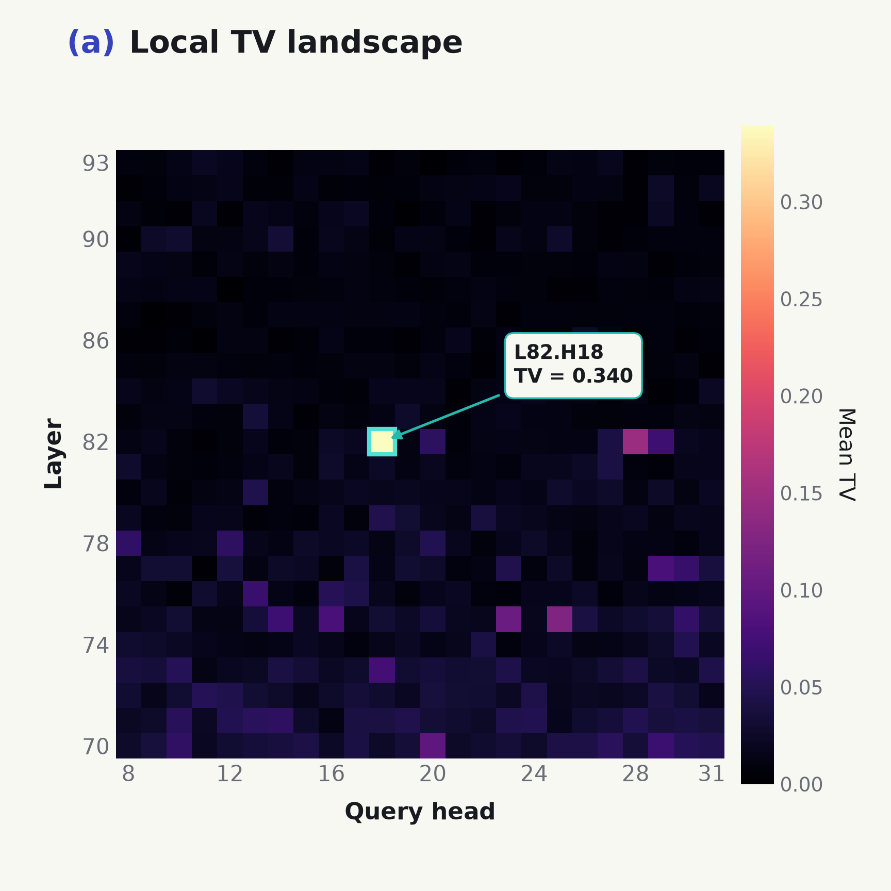
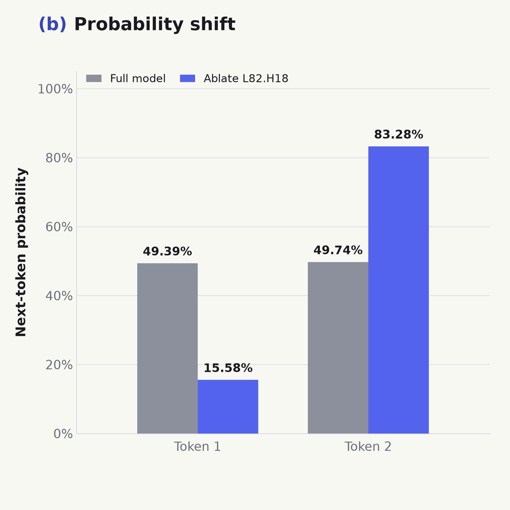
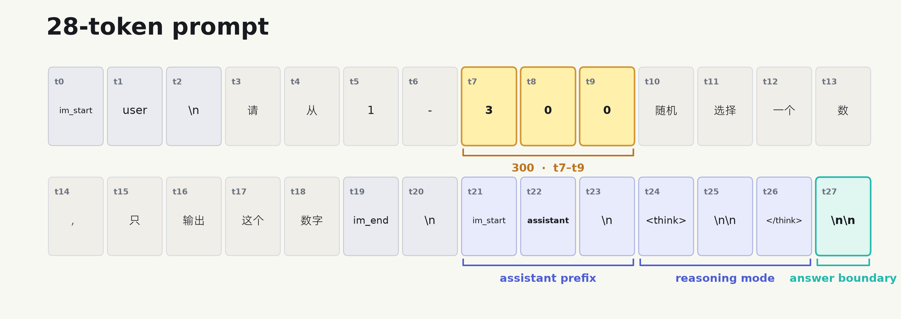
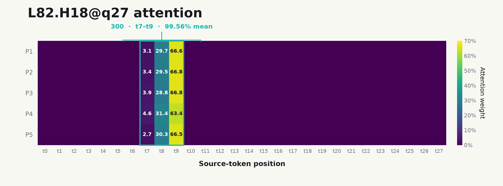
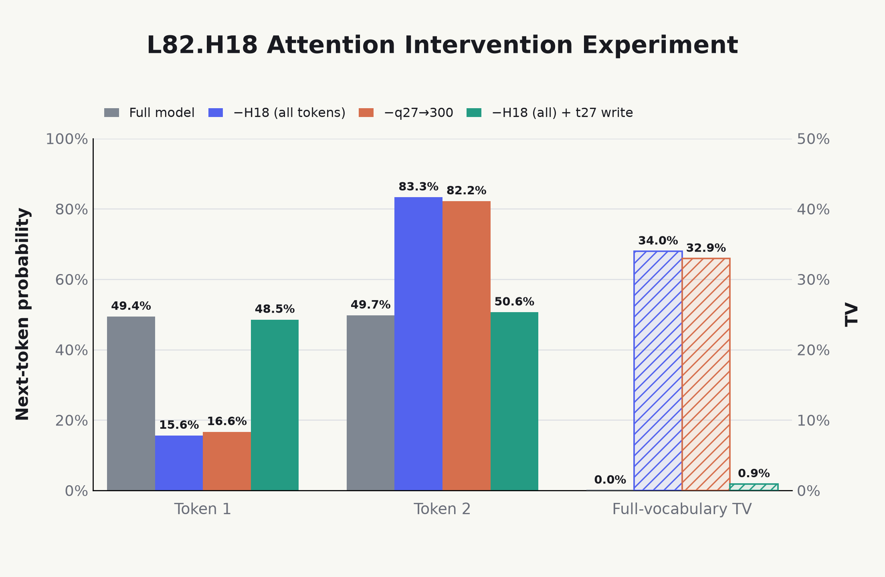
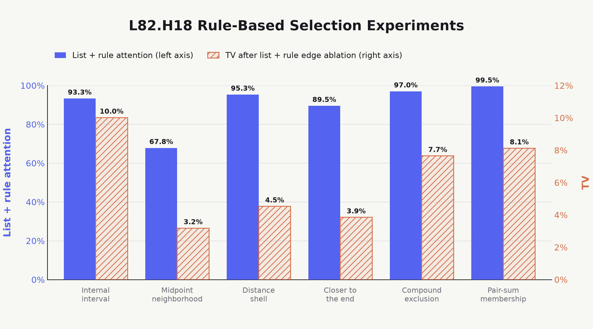
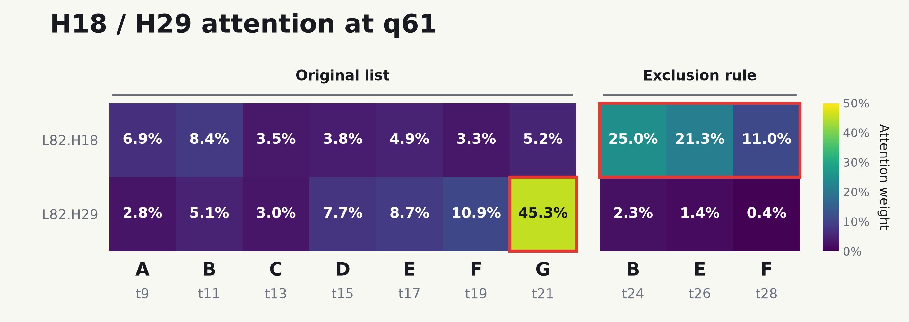
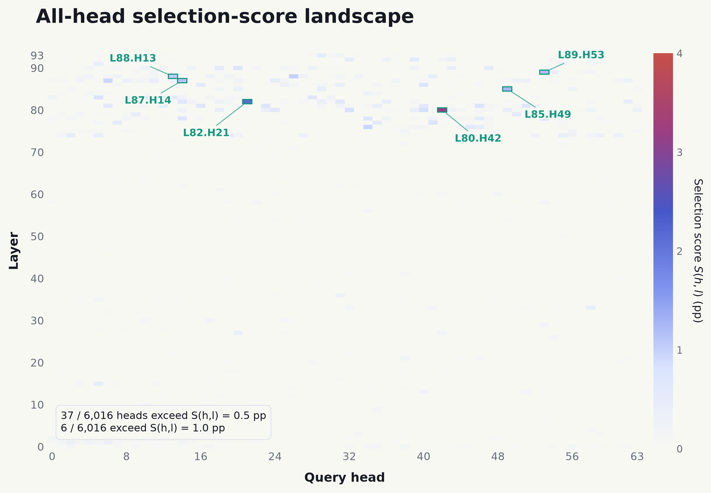
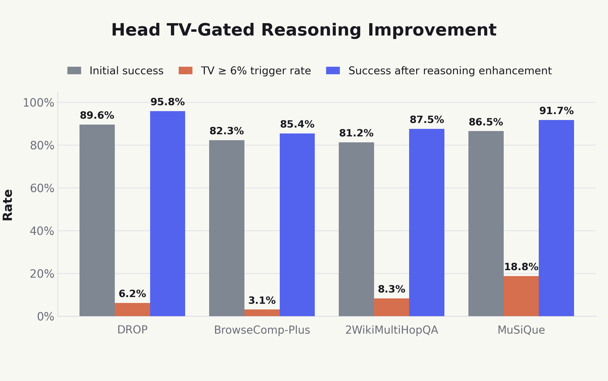

从模型的随机数指纹出发：\
一项关于 LLM 推理回路的研究
===========================

作者

发布日期

2026年8月30日

一直以来，围绕如何判断 GPT「降智」或者说路由到小模型的讨论层出不穷。一篇 [LINUX DO 帖子](https://linux.do/t/topic/2472419) 提出了一种简单的判断方法：让模型从给定范围中随机选择数字，多次采样它的输出分布，并将其当作统计指纹来识别模型¹。

注 1

当然，自从 Astra 出来之后，似乎更主流的测试方法是鹈鹕骑自行车，具体可以参见这篇 [LINUX DO 帖子](https://linux.do/t/topic/2858863)。

这个方法为何能区分不同模型并不难理解，但相比之下，另一个问题似乎更有值得研究：

**模型内部蕴含的这种随机数指纹，在推理过程中是如何被写入的？**

为了研究该问题，我们从提示词「在 1–300 中随机选择一个数」出发，定位到了一类会强烈读取候选范围 `300` 的 heads。进一步的实验逐渐揭示出其更一般的作用：读取推理任务的候选集合，当答案尚未被有效推理出来、模型仍需在多个候选之间进行竞争时，这些 heads 写入残差流的信息会显著改变输出。

而当我们在正常的推理过程中，手动截断模型的推理回路（例如删除关键推理链，或者屏蔽检索 heads），使模型陷入不确定性推理时，这类 head 的因果效应同样会被显著放大。这似乎揭示模型中存在两种相互竞争的回路：当模型能正常推理时，推理回路生效，而这类 heads 对应的回路被抑制；当推理回路被切断后，这种回路则产生因果效应，开始主导模型的行为。

基于这一观察，我们将这类 heads 的表现作为模型推理是否可信的信号，并且在检测到不可信推理时，启动推理增强策略。实验证明，这种策略的确能够检测不可信推理，并增强模型的性能。

**如果您对此感兴趣，请继续阅读本文，预计完整阅读时间约 30 分钟。**

## 1 背景：LLM 的非随机输出

当我们向大语言模型输入下面这段提示词时：

请从 1–300 随机选择一个数，只输出这个数字。

模型并不会在前向传播中真正「抽取」一个随机数。更准确地说，语言模型的前向传播是一个从输入文本到生成 token logits 的确定性函数。随后，解码器根据温度 T 将 logits 转换为概率分布：

p_i = \frac{\exp(z_i/T)}{\sum_j \exp(z_j/T)}.

因此，在输入 prompt 和解码设置均固定的情况下，模型为下一个 token 给出的概率分布 p 也是固定的²。

在采样解码中，采样器会使用伪随机数从分布 p 中选取 token。因此，模型的单次输出可能变化，长期统计分布却应当保持稳定。这解释了随机数选择为什么能够形成模型指纹：不同模型具有不同的架构和参数，会为各个数字 token 分配不同的生成概率，重复采样后，概率则表现为可识别的输出分布。

注 2

实际推理服务未必能做到逐 bit 可复现。vLLM、SGLang 等推理后端中的批处理和并行归约可能改变浮点运算顺序，从而产生数值差异。可参见 Thinking Machines Lab 的博客：[Defeating Nondeterminism in LLM Inference](https://thinkingmachines.ai/blog/defeating-nondeterminism-in-llm-inference/)。

我们真正关注的问题是：**这种概率分布在模型前向传播过程中，是如何被写入和生成的？**

## 2 写入随机数指纹的 Head

在 LLM 前向传播的过程中，QK 决定了注意力从哪里读取，OV 决定了向残差流写入什么，这些信息在 MoE 中被读取和处理，最终在输出层形成 logits 分布。

对于随机数生成任务，按照上述对 LLM 信息流的理解，一个合理的推测是：模型的深层可能存在一些 heads，它们编码了 `1–300` 这一范围信息，让下游计算可以读取随机数的选取区间。该信息被写入残差流并形成输出，模型的选择偏好也在这一过程中被写入。

从这一推测出发，我们在 MOE 模型 Qwen3-235B-A22B 上进行实验。我们构造与「请从1-300随机选择一个数，只输出这个数字」类似的 9 条中文 prompts，其均要求模型从 `1–300` 中随机选择一个数，但采用了不同的语义表述。

实验结果表明，不同 prompts 的具体概率分布会有所变化，但整体结构保持稳定：生成 token 的概率质量几乎全部集中在数字上，且数字 `1` 和 `2` 始终构成最主要的竞争。

|  P(1)  |  P(2)  | P(3\text{–}9) | P(\text{数字}) |
|:------:|:------:|:-------------:|:--------------:|
| 49.39% | 49.74% |     0.73%     |     99.86%     |

我们接下来将**「哪个 head 会最大程度破坏这种生成偏好」**作为寻找关键 head 的标准。

### 2.1 Head 定位

Qwen3-235B-A22B 共有 94 层、每层 64 个 query heads。我们对每个 head 进行消融观察，在该层 attention 的 `o_proj` 之前，将目标 head 在所有输入 token 位置的 128 维输出切片置零，同时保持其他计算不变。

为了衡量消融前后完整词表概率分布的差异，我们使用总变差距离（total variation distance，TV）：

\operatorname{TV}(h,l) =\operatorname{TV}\\\left(p,p^{(h,l)}\right) =\frac{1}{2}\sum\_{v\in\mathcal V} \left\|p(v)-p^{(h,l)}(v)\right\|.

其中 p 是原始下一 token 分布，p^{(h,l)} 是删除 head (h,l) 后的分布。TV 越大，说明这个 head 对当前输出分布的因果影响越强。

通过「全量粗筛 + 独立复验」，我们定位到最显著的 head 为 `L82.H18`；其全词表 TV 达到 `0.34`，在所有 heads 中最强，并且与第二名拉开了显著差距⁴。

注 4

`L82.H18` 在中心化全词表 logit \operatorname{RMS}\_{c}(h,l) 中同样排名第一，其定义为：

\operatorname{RMS}\_{c}(h,l)= \sqrt{\frac{1}{\|\mathcal V\|}\sum\_{v\in\mathcal V} \left(\Delta z_v^{(h,l)}-\overline{\Delta z}^{(h,l)}\right)^2}.

其中 \Delta z_v^{(h,l)} 为删除 head (h,l) 后 token v 的 logit 变化，\overline{\Delta z}^{(h,l)} 为其全词表均值。\operatorname{RMS}\_{c}(h,l) 表示删除该 head 对全词表 logit 结构的整体影响。

图 1(a)：`L82.H18` 周围的局部 TV 热图。

图 1(b)：完整模型与删除 `L82.H18` 后的 P(1) 和 P(2)。

删除 `L82.H18` 后，所有 prompts 的 P(1) 均下降，平均变化为 `−33.80` 个百分点；与此同时，P(2) 平均变化为 `+33.54` 个百分点，其余输出概率几乎不变。

这说明，我们定位出的 `L82.H18` 的确在数字候选内部写入了强烈偏好。

### 2.2 Head 注意力分布

我们进一步观察 `L82.H18` 的注意力分布，所使用的 prompts 均包含 28 个 tokens，且具有相似的结构，其中 `300` 被拆为 t7–t9 三个 tokens，模型侧的 `assistant` 位于 t22，正式回答前的最后一个 `\n\n` 位于 t27。

图 2：经 chat template 渲染后的 28-token prompt。

实验结果表明，`L82.H18` 最集中的注意力连接是从 token `\n\n`（t27）到 token `300`（t7–t9），注意力质量平均为 99.56%，图 3 展示了其中 5 条代表性 prompts 的注意力分布。

图 3：`L82.H18@q27` 在 5 条代表性 prompts 上的注意力分布。每行表示一条 prompt，每列表示一个 source token 位置，token `300` 始终在 t7–t9 位置⁵。

注 5

大部分注意力在 `300` 的最后一个 token，这符合我们的直觉：因为前向传播是逐 token 的，最后一个 token 的表征才可能汇聚全局信息，而后被下游任务注意并使用。

换言之，在模型准备生成答案时，`L82.H18` 几乎只从数值上界 `300` 读取信息，再把得到的向量写入回答位置的残差流。

### 2.3 Head 注意力干预

为了判断上述显著注意力边是否真正主导输出变化，我们在相同的 prompts 上，进一步进行如下几种对 `L82.H18` 的注意力干预实验：

- **完整模型**：不进行任何干预，作为基线。
- **删除 `L82.H18`**：将 `L82.H18` 在所有位置的 128 维输出置零。
- **删除 `q27→300` 注意力边**：只将 q27 指向 t7–t9 的三条边置零。
- **删除 `L82.H18` 后补回 `q27→300` 写入**：先删除 `L82.H18`，再在 t27 补入主要由 t7–t9 贡献的原始残差写入向量，其余 token 位置仍保持删除。

前三种实验检验 `q27→300` 注意力边是否主导 `L82.H18` 的行为；第四种实验反向补回这条边写入残差流的信息，检验能否恢复完整 head 的作用。

图 4：四种条件下的平均下一 token 概率与全词表 TV。

实验结果表明，删除 `q27→300` 注意力边后，其效应能达到删除完整 `L82.H18` 效应的 **96.95%**。也就是说，几乎全部 head-level 因果效应都能由 `q27→300` 复现；在删除完整 `L82.H18` 后，仅补回 `q27→300` 主导的残差写入，能恢复原始删除效应的 **97.33%**。

这说明 `L82.H18` 的作用确实是将候选范围信息搬运到最终回答位置，并在这个过程中将偏好写入残差流，最终在输出中形成模型指纹。

## 3 Head 泛化实验

目前为止，我们证明了 `L82.H18` 在「从 1–300 中随机选数」这一任务中的重要特性。一个自然的问题是：这种特性的泛化性如何，`L82.H18` 能在其它任务中展现出类似的「将候选信息汇总搬运，以支持模型的输出」这一特性么，以及它是否能够实现更一般的功能？

为此，我们进行了泛化实验，依次改变候选类型、候选约束和下游任务，以探究 head 在各种场景设定下的作用。

### 3.1 候选类型泛化实验

我们先检验最直接的泛化：如果把数字候选换成其他类型的候选，`L82.H18` 是否仍会展现出相同的特性？为此，我们将原任务中的 `1–300` 替换成字母范围：

请从 A 到 D 中任选一个，只输出这个字母。

实验结果与数字范围几乎一致。`L82.H18` 对字母 `D` 的注意力为 **88.62%**；删除这条显著注意力边后，TV 高达 **30.3%**。

我们进一步把输入候选扩展为显式列表，以检验该特性能否扩展到一般候选集合。所有实验都使用如下相同模板：

请从候选列表【……】中任选一个，只输出被选中的候选。

实验只替换列表【……】中的候选对象。我们构建了 40 种七元素列表，其中包括 20 种规范列表和 20 种非规范列表：

- **规范列表**：列表内元素本身具有强烈的顺序关系，并且按照该顺序排列，例如天干列表【甲、乙、丙、丁……】。
- **非规范列表**：列表元素之间不存在稳定的内在顺序，排列顺序杂乱，例如食物列表【饺子、面条、米饭、包子……】。

| 列表类型       | 列表末项注意力 | 候选总注意力 | 删除列表注意力边后的 TV |
|----------------|---------------:|-------------:|------------------------:|
| **规范列表**   |         24.09% |       75.60% |                    7.2% |
| **非规范列表** |          6.56% |       41.89% |                    2.7% |

实验结果表明，`L82.H18` 在规范列表上的表现显著更强，其分配给全部候选和列表末项的注意力都更高；删除指向全部列表元素的注意力边后，规范列表的 TV 也明显更高⁶。

注 6

列表具备的序关系越明显或越常见，`L82.H18` 的效果越强。例如，数字列表 `[1, 2, 3, 4]` 强于季节列表 `[春，夏，秋，冬]`。

我们进一步探究列表顺序的影响，以判断这种影响是基于列表元素内蕴的序关系，还是必须按照顺序列出。我们将列表中的元素完全逆序，并额外构造了多种乱序，而后观察 `L82.H18` 的表现，实验共包含 280 条 prompts。

| 列表类型       | 排列 | 列表末项注意力 | 候选总注意力 | 删除列表注意力边后的 TV |
|----------------|------|----------------|--------------|-------------------------|
| **规范列表**   | 逆序 | 11.27%         | 62.43%       | 4.8%                    |
|                | 乱序 | 17.07%         | 68.90%       | 8.2%                    |
| **非规范列表** | 逆序 | 10.65%         | 44.76%       | 2.6%                    |
|                | 乱序 | 7.54%          | 44.40%       | 2.5%                    |

总体而言，列表顺序的影响不大。非规范列表在原序、逆序和乱序下的注意力和 TV 基本不变；规范列表中只有完全逆序带来了较明显的 TV 下降，但仍然显著高于所有非规范列表条件。规范列表在多种顺序下仍然保持了较高的注意力和 TV，这说明 `L82.H18` 能够识别候选集合具有严格内在顺序这一类信息，而不是只基于 prompt 输入中列表的顺序，并将信息移动至下游残差流并写入模型偏好⁷。

注 7

目前尚不清楚这一过程产生在预训练还是后训练中。我倾向于认为，在数字候选输入中，`1` 和 `2` 的概率高于其他数字，是由预训练语料中庞大的数字分布决定的；但是，模型对数字 `1`、`2` 之间的明显偏好，更像是在后训练中被编码的。这也能解释为什么所有模型都更喜欢生成 `1` 和 `2`，但具体的概率却形成了不同的指纹。

### 3.2 候选约束泛化实验

接下来，我们探究候选约束的泛化：当我们在候选全集上增加约束、改变实际允许选择的集合时，`L82.H18` 是否会转而注意用于界定该集合的约束信息？我们首先进行一个简单的实验，保留原任务中的 `1–300` 范围，并额外要求所选数字小于 `150`：

请从1-300中小于150的数里随机选择一个，只输出这个数字

实验结果显示，在最终回答位置，`L82.H18` 对新增约束「小于 150」中的 `150` 分配了 **83.42%** 的注意力，对原始上界 `300` 的注意力则降至 **9.07%**。删除该 head 在最终回答位置的写入后，TV 高达 **44.4%**。这说明此时 `L82.H18` 的主要读取位置转向新的候选边界，并且其写入仍然会显著影响输出概率分布。

我们进一步将实验扩展到不同类型的规范列表（见[第 3.1 节](#候选类型泛化实验)），并为每个列表构造 8 种活动子集。我们在题干中额外指定本次允许选择的活动集合，固定使用以下句式：

候选全集为【…】。本次允许集合为【…】。请从允许集合中随机选择一项，只输出答案

例如，对于字母列表【A、B、C、D、E、F、G、H】，额外指定允许集合为【A、C、E】。我们分别统计最终回答位置的 `L82.H18` 对题干中重述的活动集合和原始全集的注意力，并观察同时删除指向原始全集与活动集合的注意力边后的 TV：

[TABLE]

实验结果表明，各类列表中，`L82.H18` 对活动集合的平均注意力均高于对原始全集的注意力，两者总体均值分别为 **57.06%** 和 **17.17%**。这说明，`L82.H18` 的确会根据额外约束，将主要注意力转向当前实际允许选择的活动候选。同时删除指向原始全集与活动集合的注意力边后，总体平均 TV 为 **8.1%**，表明对这两处候选信息的联合读取会影响输出概率分布。

我们进一步进行了实验，构建了更复杂的基于规则的列表筛选任务。这次不再直接列出活动候选集合，而是提供完整列表与筛选规则，要求模型从满足规则的候选中任意选择一项。这里的筛选规则包含内部区间、中点邻域、距离壳层、末端半区、复合排除和配对求和。下方的柱状图展示了每类任务中 `L82.H18` 对列表与规则的平均注意力，以及对应的删边 TV。

图 5：`L82.H18` 在六类规则筛选任务中的平均注意力与联合删边 TV。实心柱表示对列表和规则描述的总注意力（左轴），斜线柱表示删除对应注意力边后的全词表 TV（右轴）。

实验结果与之前类似，`L82.H18` 的主要注意力都分配给了列表和规则描述。删除指向这些位置的注意力边，并对其余 source 重新归一化后，各类任务的平均 TV 达到 **3.2%–10.0%**，表明这些读取对输出概率分布具有明显的因果影响。

此外，在进行实验的过程中，我们还发现了 head 功能分化的现象。具体来说，尽管先前的实验中我们以 `L82.H18` 作为实验对象，但具备类似功能的 head 不止这一个。对于同层另一个具有类似功能的 head `L82.H29`⁸，我们发现在约束选择任务中，两个 head 的读取侧重会发生分化：`L82.H18` 更关注用于界定候选范围的约束，而 `L82.H29` 更关注原始列表中的最后一位候选。

注 8

该 head 通过与[第 2.1 节](#head-定位)类似的全量筛选与复验方法定位。在原始 `1–300` 随机选数任务中，其对 `300` 的平均注意力在全部 6,016 个 heads 中排名第一；中心化全词表 logit \operatorname{RMS}\_{c}(h,l) 在所有 heads 中排名第二。

下面这条 prompt 是一个直观的例子：「给定有序字母列表【A，B，C，D，E，F，G】。B、E与F均不可选择；请在其余字母中任选一项。只输出所选字母，不要解释。答案：」在相同的最终回答位置 `q61`，`L82.H18` 对约束 token（如 `B/E/F`）的总注意力为 **57.60%**；相比之下，`L82.H29` 对原始列表中的末项 `G` 的注意力高达 **45.33%**。删除两者的对应高注意力边的 TV 分别为 **23.9%** 和 **5.0%**。

图 6：同一条 prompt 上，`L82.H18`（第一行）与 `L82.H29`（第二行）在最终回答位置 `q61` 的注意力分布。每列为一个实际 source token：左侧是原始列表中的 `A–G`，右侧是约束中再次出现的 `B/E/F`；字母下方标注原始 token 位置。

这个例子展示了不同 heads 在读取位置及其因果作用上的分化。这提示模型中存在多种不同的计算回路，携带不同角度的信息，并可能在后续深层计算中汇合，共同影响下游任务。

### 3.3 任务类型泛化实验

我们接下来探究 `L82.H18` 的行为是否能泛化到下游任务，而不仅仅局限于随机选择。我们保持输入为 `1–300` 范围，构建多种下游任务，并观察 head 的行为。初步实验发现，head 的有效性似乎与任务允许的合法候选个数有关。具体来说，我们根据任务类型将其分为两组：

- **非唯一性任务**：任务的答案具备非唯一性，有多个合法候选，模型输出其中任何一个候选可视为满足任务要求。
- **唯一性任务**：任务的答案具备唯一性，仅有一个合法候选，模型仅输出该候选才可视为满足任务要求。

| 任务类型         | 对 `300` 的注意力 | 删除 `L82.H18` 注意力边的 TV |
|------------------|------------------:|-----------------------------:|
| **非唯一性任务** |           92.231% |                        13.7% |
| **唯一性任务**   |           58.862% |                         0.5% |

在两组任务中，`L82.H18` 都展现出了对 `300` 的显著注意力，但是只有在非唯一性任务中，删除 head 的 TV 才产生显著变化⁹。

注 9

但是并非所有非唯一性任务都会导致显著的 TV 变化。例如，在「从 1–300 中选出大于 250 的数」这一任务中，TV 影响只有 0.3%。一个合理的猜测是：虽然该任务有多个合法候选，但是这些合法候选的首个输出 token 都必须是 `2`，因此不受到影响。

因此，`L82.H18` 不能简单地被视为只在随机选择任务中才生效的 head。它在唯一性任务中仍会注意候选边界，这意味着 `L82.H18` 会把范围信息输送到回答位置；但是似乎只有当答案尚未被锁定、模型仍需要在合法候选之间分配概率时，下游任务才会强烈使用这份信息¹⁰。

注 10

事实上，我一开始并没有意识到这一点，而是错误地以为当输出需要全局信息时，head 才会生效，但是更多的实验排除了这一猜测。造成这一错误推论的原因是，许多非唯一性任务需要汇聚全局信息才能推测出合法候选。

我们进一步检验上述判断，一个合理的直觉是：如果 `L82.H18` 的显著作用确实来自「模型尚不确定答案」，那么对于足够困难的任务，即使只有唯一答案，但是模型自身无法有效推理出答案，`L82.H18` 也应当显著生效。

我们据此进行了对比实验，构造了两类需要使用全局信息的唯一性任务，任务难度分别为**简单**与**困难**。两类任务的措辞和长度尽量保持一致，以排除提示长度和表述形式等因素的影响。和之前的实验配置一样，模型全程不开启 thinking 模式；我们分别比较其在正序列表和乱序列表下的正确率、列表注意力，以及删除指向列表元素的注意力边之后的 TV。

| 任务难度     | 正序   |            |           | 乱序   |            |           |
|--------------|--------|------------|-----------|--------|------------|-----------|
|              | 正确率 | 列表注意力 | 列表边 TV | 正确率 | 列表注意力 | 列表边 TV |
| **简单任务** | 100.0% | 10.08%     | 0.24%     | 98.0%  | 2.47%      | 0.24%     |
| **困难任务** | 52.5%  | 66.17%     | 5.39%     | 52.0%  | 60.38%     | 4.40%     |

结果与推论大致一致，简单任务正确率达到 **100%**，说明模型在直接作答前已经锁定答案，此时对列表的注意力较低，且列表边 TV 也仅为约 **0.24%**；相比之下，困难任务的正确率只有约 **52%**，模型难以稳定推理出唯一答案，此时注意力上升至约 **60%**，列表边 TV 上升到 **5.39%**。这表明，当答案未被有效推理出来时，`L82.H18` 会持续从原列表读取更多信息，并具备更强的因果效应，搬运的候选信息会显著影响输出概率分布。

为了进一步观察这一关系是否成立，我们进行了更多不同难度的任务，并将各任务的成功率与列表边 TV 汇总在如下散点图中。图中每个点对应一个任务，可以看到，较难的任务的确具备更高的 TV，两者的相关系数为 -0.84。

图 7：不同任务的成功率与 `L82.H18` 列表边 TV。横轴为任务成功率，纵轴为删除回答位置上 `L82.H18` 指向全部列表元素的注意力边之后的全词表 TV。

至此，我们关于 `L82.H18` 生效条件的断言似乎初步成立。

### 3.4 长程思考泛化实验

[第 3.3 节](#sec-task-type-generalization)的实验始终关闭 thinking 模式，因此为了判断上述关于 `L82.H18` 生效条件的断言能否泛化到长程思考，我们开启 thinking 模式进行实验，让模型先生成完整 reasoning，而后在回答开始时直接输出答案，最后在 `</think>` 之后的最终回答位置测量 `L82.H18` 的各项指标。我们选取了一些典型任务，覆盖多个正确率梯度，将非 thinking 模式和 thinking 模式的对比结果列于下表：

| 任务               | no-think |            |           | think  |            |           |
|--------------------|----------|------------|-----------|--------|------------|-----------|
|                    | 成功率   | 列表注意力 | 列表边 TV | 成功率 | 列表注意力 | 列表边 TV |
| 最接近首尾几何平均 | 2.08%    | 81.41%     | 8.61%     | 95.83% | 5.38%      | 0.015%    |
| 最近奇数位序号均值 | 18.75%   | 68.54%     | 8.06%     | 100%   | 7.30%      | 0.008%    |
| 最接近序号均值     | 22.92%   | 72.08%     | 6.93%     | 100%   | 6.01%      | 0.007%    |
| 最大序号间隔后项   | 29.17%   | 71.92%     | 5.79%     | 100%   | 5.28%      | 0.011%    |
| 偶数展示位规范最早 | 43.75%   | 55.38%     | 3.97%     | 97.92% | 4.10%      | 0.002%    |
| 规范第 2 项        | 70.83%   | 54.34%     | 3.15%     | 100%   | 11.24%     | 0.003%    |
| 展示第 5 项        | 93.75%   | 40.14%     | 1.24%     | 100%   | 4.46%      | 0.003%    |

开启 thinking 后，任务正确率上升到将近 100%，列表边 TV 则全部下降到几乎 0%；与此同时，分配给原列表的注意力也急剧降低。这一观察与之前类似，说明当长程思考已经推理出答案时，模型的回答几乎不再依赖 `L82.H18` 搬运原列表信息¹¹。

注 11

另一个值得注意的点是，任务成功率越高，`L82.H18` 对列表的注意力就越小。目前尚不确定是较少的注意力直接导致了较小的 TV，还是注意力与 TV 随任务难度共同变化的表现反映了某种更深层的回路机制。我个人更倾向于后一种解释。

不过，thinking 模式会在输入列表与最终回答之间加入较长的 reasoning，因此 TV 下降也可能只是由回答位置与列表位置之间的距离增加造成的。为了排除这一解释，我们进行了对比实验：在保持输入列表和任务不变的基础上，分别构造了严格等长的四种组合，即 **no-think**／**forced-think** 与 **正确推理**／**等长占位** 的排列组合。这里，**forced-think** 是指开启模型思考，并且在思考中填入预先准备的信息；**正确推理**是能够帮助得出答案的推理过程，而**等长占位**则是与任务无关的相同长度占位符。所有设置下最终回答位置的长度一致。

| 条件                            | 完整答案正确率 | 原列表注意力 | 列表边 TV |
|---------------------------------|---------------:|-------------:|----------:|
| **no-think** + **正确信息**     |           100% |       5.897% |    0.140% |
| **no-think** + **等长占位**     |          25.0% |      57.133% |    8.197% |
| **forced-think** + **正确推理** |           100% |       6.358% |    0.009% |
| **forced-think** + **等长占位** |          23.6% |      61.551% |    5.266% |

结果表明，prompt 或 reasoning 的长度并不会让 `L82.H18` 失效：两个等长占位条件下列表边 TV 仍然大于 5%，只有当加入足以确定答案的推理过程后，正确率上升到 100%，列表注意力和 TV 才同时大幅下降。因此，造成变化的主要因素并不是长程距离，也和是否开启 thinking 无关，而是答案是否已经被上下文锁定。

上述结果进一步加强了[第 3.3 节](#sec-task-type-generalization)的论述：只要答案未被有效推理或者确定，`L82.H18` 搬运的候选信息就会显著影响输出分布。

### 3.5 跨 Head 功能泛化实验

在之前的实验中，我们主要以 `L82.H18` 为研究对象。但正如[第 3.1 节](#候选类型泛化实验)中所指出的，这组 heads 只有在列表内部具备强烈的顺序关系时，才会展现出较强的因果效应，这使得其生效范围较为狭窄。

一个自然的问题是：对于顺序关系不那么强的列表，是否仍然存在一族 heads，展现出类似的功能？事实上，从 head 功能分化和 Transformer circuit 的角度来看，类似的 heads 时应当存在的¹²。基于这一理念，我们进一步进行实验，观察对于一般列表，是否还有类似功能的 heads。

注 12

从更顶层的视角来看，我更愿意将其称为信息分散的一种体现，尤其是模型越大、能力越强时越是如此。多个 heads 可能负责类似的功能，但其生效的具体场景可能有所差异。

类似[第 2 节](#写入随机数指纹的-head)的设定，我们构建了多个随机中文单 token 无序候选列表，并分别执行随机选择和确定性选择任务，而后扫描全部 6,016 个 query heads，同样执行消融观察，在 attention 的 `o_proj` 之前将输出切片置零。基于之前的观察，我们将筛选分数定义为

S(h,l)=\max\\\left(\Delta \operatorname{TV}(h,l),0\right)\times A(h,l),

其中 \Delta \operatorname{TV}(h,l) 是随机选择与确定性选择之间，删除 head 后的 \operatorname{TV} 之差，A(h,l) 是随机选择下 head 对候选列表的总注意力。该指标同时要求 head 读取候选列表，且其因果效应主要出现在答案尚未确定时，以排除类似语法 head 或 ICL head 等偏置的干扰。

最终我们选出了得分最高的六个 heads：`L80.H42`、`L82.H21`、`L85.H49`、`L89.H53`、`L87.H14` 和 `L88.H13`。它们也是仅有的 S(h,l) 得分高于 1 pp 的 heads。

图 8：全模型 heads 的 S(h,l) 热力图，其中得分最高的六个 heads 已经被标出。

从图中可以看到，得分较高的 heads 均位于深层，浅层和中层 heads 几乎都呈现出纯白色。这符合认知：这类能汇聚信息流并影响下游任务的能力主要只会出现在深层 heads 中。同时，除选出的 heads 外，许多深层 heads 也表现出较弱但可见的 S(h,l) 响应，整体功能响应呈现出零散分布，这也是[注 12](#note-head-information-dispersion)中所说的信息分散的一种表现。

更多的实验表明，这些 heads 与 `L82.H18` 展现出相似作用：答案未决时，它们集中读取候选列表，删除后会明显改变输出分布；答案已经确定时，其因果效应则接近消失。为了保持博客的可读性，我们不再赘述这些实验，在下一节中，我们会使用定位出来的更一般性的head进行干预实验，进一步揭示其工作机制和信息回路。

## 4 候选 Head 回路的因果干预实验

经过[第 3 节](#sec-head-generalization)的一系列实验，我们定位出了一族具有相似功能的 heads，并对其作用形成了一个初步判断

**当答案未被有效推理出来、模型仍需在多个候选之间进行竞争时，下游任务会强烈使用这族 heads 搬运的候选信息**

这一现象可以泛化到不同的候选列表、不同的候选约束、不同的任务类型，以及包含长程 thinking 的回答过程。

进一步思考，我们从 Transformer circuit 的角度重新审视这一结果。我们知道，模型的前向传播过程并不是由单一信号决定的，相反，不同回路会将等多种信号写入残差流，并最终共同觉醒输出。按照我的理解，一个很重要的洞见是：

通常情况下，最强的信号会主导模型行为，其他信号虽然仍然存在，但会在竞争中被压制；但是当原本占主导地位的回路变弱甚至截断时，次强回路便可能获得更大的相对权重，并对缺失的信息进行的补偿。在规模更大、信息表示更加分散的模型中，这种回路之间的竞争机制尤其明显。

从这一视角来看，我们定位出的 heads 共同参与了一大类候选竞争回路：当模型能够正常完成推理时，确定答案的信号占据主导，这类回路的写入难以影响最终输出，删除这些 heads 产生的 TV 很小；当正常推理信号较弱，或者相应回路被截断时，这类回路的写入便会获得更大的因果效应，表现为删除 heads 后的 TV 显著上升。

[第 3.4 节](#sec-long-thinking-generalization)和[第 3.5 节](#sec-cross-head-generalization)的实验已经初步支持了这一观点。我们进一步采用主动的干预实验进行检验，我们采用多种方法破坏模型正常推理的回路，而后观察在这些干预下，候选 heads 的因果效应是否会如预期般增强，以及是否会稳定出现。

### 4.1 删除输入证据的干预实验

为了破坏模型正常推理的回路，一个直接的想法是从输入侧删除关键证据，这可以视为破坏推理路径的起始点。

为此，我们选取 DROP、BrowseComp-Plus、2WikiMultiHopQA 和 MuSiQue 这四个数据集，构造反事实的问答基例：每个问题都被改写，正确答案及其他候选均被替换为随机生成的临时代号，代号的拼写和数字不包含任何可供推断的规律，以防止模型利用参数化记忆回答问题。

每个基例分别包含**完整证据**和**缺乏证据**两个版本，其问题、候选列表和正确代号完全相同，唯一的区别是：**缺乏证据**版本删除了输入中推理所需要的关键证据，使模型无法再从给定资料中唯一确定正确候选；**完整证据**版本则予以保留。我们在每个输入 prompt 的 thinking 结束、第一个正式回答开始的位置，联合删除[第 3.5 节](#sec-cross-head-generalization)中定位出的 heads 的写入，而后计算干预前后完整词表概率分布的 TV。

| 数据集 | **成功率（完整证据 → 缺乏证据）** | **删除 head 的 TV（完整证据 → 缺乏证据）** |
|----|---:|---:|
| DROP | **100%**→**7.69%** | **0.639%**→**8.129%** |
| BrowseComp-Plus | **90%**→**3.33%** | **1.797%**→**6.153%** |
| 2WikiMultiHopQA | **90.48%**→**0%** | **2.006%**→**6.732%** |
| MuSiQue | **94.44%**→**0%** | **0.130%**→**7.466%** |

所有数据集都呈现出一致的结果：完整证据下的成功率近乎 **100%**，此时删除 heads 后的 TV 较小；删除关键证据后，成功率急剧下降，模型几乎无法推理，此时 TV 则显著上升。实验结果符合我们的预期：当推理回路的起始输入被截断时，heads 搬运的候选信息获得了显著更高的权重。

### 4.2 删除关键推理链的干预实验

我们进一步从模型的推理过程入手，删除 reasoning 中用于识别正确答案的推理链路，并观察 heads 的因果效应变化，这一干预可以视为破坏推理回路的中段。

我们仍然使用[第 4.1 节](#删除输入证据的干预实验)中的反事实数据集以及[第 3.5 节](#sec-cross-head-generalization)定位的 heads，并分别构造**完整推理链**和**缺失推理链**两个版本。两者区别是：**完整推理链**版本注入了模型在完整证据条件下生成的多段 Agent 式 reasoning；**缺失推理链**版本则在同一条 reasoning 中，删除从首次提及到最后一次提及正确代号的连续推理段落。两者最后都以“我已经完成推理并且已经知道答案”结束，而后让模型生成正式答案。我们还是在第一个正式回答 token 的位置观察 heads 的效应。

| 数据集 | **成功率（完整推理链 → 缺失推理链）** | **删除 head 的 TV（完整推理链 → 缺失推理链）** |
|----|---:|---:|
| DROP | **100%**→**0%** | **1.133%**→**8.428%** |
| BrowseComp-Plus | **100%**→**0%** | **1.098%**→**5.304%** |
| 2WikiMultiHopQA | **100%**→**0%** | **0.910%**→**7.956%** |
| MuSiQue | **100%**→**0%** | **1.454%**→**7.282%** |

可以看到，在删除部分推理链路后，模型在所有轨迹上的成功推理均变成失败推理，删除候选 heads 的平均 TV 也从 **1.133%** 上升至 **7.277%**。实验结果同样符合我们的预期，证明了当推理回路的中段被截断时，heads 搬运的信息同样获得了更高的权重。

### 4.3 删除检索 Head 的干预实验

之前我们分别从输入侧和推理链破坏了正常推理路径，现在我们考虑截断推理回路的末端：保持问题和输入证据完整，只屏蔽从上下文中搬运答案的 retrieval heads¹³。此时虽然原始证据仍然存在于上下文，但是模型失去了利用证据的能力，我们观察这种情况下，候选 heads 的 TV 是否也显著上升。

注 13

关于 retrieval heads 的定义和作用，请参考原始论文：[Retrieval Head Mechanistically Explains Long-Context Factuality](https://arxiv.org/abs/2404.15574)。近期我的一些实验观察表明，retrieval heads 的作用是在推理回路的末端、模型已经知道答案时，将其从上下文中搬运到 decode 输出位置。

为此，首先我们参照原始论文的方法，定位出 top-20 的 retrieval heads（约占所有 heads 的 0.3%），最终结果如下：

`L81.H53`、`L81.H61`、`L79.H52`、`L81.H34`、`L85.H29`、`L79.H59`、`L81.H51`、`L83.H08`、`L61.H51`、`L61.H61`、`L81.H54`、`L76.H39`、`L81.H45`、`L06.H16`、`L79.H63`、`L59.H59`、`L61.H54`、`L82.H25`、`L83.H05`、`L83.H10`。

并将其记作 R；将先前定位出来的搬运候选信息的 heads 记作 C。我们考虑如下四种条件：完整模型 `clean`、只删除检索回路 `−R`、只删除候选回路 `−C`、同时删除两者 `−R−C`。

我们还是在先前使用的反事实数据集上进行实验，并且进行筛选，仅在那些 `clean` 下回答正确、`−R` 下回答错误的轨迹上进行实验。在每个轨迹上，我们均观察如下三种 TV：

- \operatorname{TV}(\mathit{clean},-R)：衡量删除检索 heads 的效应，由于删除后模型由回答正确切换为错误，这一数值将会极度高；
- \operatorname{TV}(\mathit{clean},-C)：衡量删除候选 heads 的效应，由于推理回路完整时模型能确定答案，我们预期这一数值将较小；
- \operatorname{TV}(-R,-R-C)：衡量推理回路被切断后，删除候选 heads 的效应，我们预期这一数值会显著高于 \operatorname{TV}(\mathit{clean},-C)。

| 数据集 | \operatorname{TV}(\mathit{clean},-R) | \operatorname{TV}(\mathit{clean},-C) | \operatorname{TV}(-R,-R-C) |
|----|---:|---:|---:|
| DROP | **65.507%** | **2.442%** | **7.459%** |
| BrowseComp-Plus | **41.133%** | **2.376%** | **17.158%** |
| 2WikiMultiHopQA | **54.411%** | **1.868%** | **10.483%** |
| MuSiQue | **34.428%** | **2.713%** | **5.042%** |

实验结果与预期一致，所有数据集上的 \operatorname{TV}(\mathit{clean},-R) 均极度高，说明推理回路的确被有效截断。而在屏蔽掉检索 heads 后，候选 heads 的 TV 均显著上升，提升从 **2.329%** 到 **14.782%** 不等。这些结果表明，推理回路中主导搬运答案的末端功能被截断后，候选 heads 搬运的信息如预期般获得更高的权重。

总体而言，上述实验进一步支持了不同回路之间存在竞争的解释：正常推理回路较强时，候选回路的作用会被压制；当推理回路失效时，候选回路则更显著地影响最终的输出。

## 5 基于检测 Head TV 的性能增强推理

经过先前的实验与观察，我们对定位出的 heads 的机制已经有了较为清晰的认识：当答案尚未被有效推理出来时，它们对输出分布的因果效应会显著增强。那么，一个自然的想法是：能否利用这一机制增强模型的推理性能？具体来说，我们能否采用如下性能增强方式：

**在正常推理输出答案后，检测候选 heads 的 TV 值；当 TV 超过阈值时，投入额外的开销继续加强推理。**

我们还是在 DROP、BrowseComp-Plus、2WikiMultiHopQA 和 MuSiQue 数据集上进行测试，并构造 Agent 式工作流，让模型基于 Search 返回的非完整信息进行推理。在推理结束并输出答案后，我们在最后一轮输出正式开始的位置，删除候选 heads 的写入，并计算删除前后完整词表分布的 TV¹⁴。

注 14

由于只需要在正式回答前的最后一个 `\n\n` 位置进行干预，因此前段所有 tokens 均可以复用 prefix cache，这确保了干预检测的低开销。具体实现中，通过 vLLM 的 `llm.collective_rpc` 切换为干预状态。

根据[第 4 节](#候选-head-回路的因果干预实验)的实验结果，我们经验性地将 TV 阈值固定为 **6%**。当干预前后的 TV 超过该阈值时，Agent 框架将继续执行工作流，通过 Search 将更多信息输入给模型，并追加一条新的用户 prompt，提示模型之前的输出可能缺乏证据，要求模型继续推理并修正答案。

图 9：基于 Head TV 检测的推理增强结果，展示了每个数据集上原始推理成功率、TV 超过阈值的频率、推理增强后的成功率。

可以看到，四个数据集上，TV 均能检测出尚未被有效推理的轨迹，并且使用增强策略后能带来的成功率收益。这说明我们定位出来的 head TV 可以作检测不可信推理的指标，并且提供一定程度的修复。

需要说明的是，方法只能检测出模型自身也未能形成稳定回路的不可信推理；对于模型自身认为可信、但实际上错误的推理，Head TV 仍然较低，无法被检测出来。

轨迹 A **成功检出**

**数据集** · **ID**  
MuSiQue · `4hop2__567956_39078_8987_8974`

问题  
Country B was the only communist country to have an embassy where?

标准答案  
Alfredo Stroessner's Paraguay

模型思考  
“根据现有资料，答案可能是 Confederate Gen. John Bell Hood”

Head TV**9.551%**

**结果**：模型猜测错误且推理不确定性较高，高 TV 成功触发增强推理，最终回答正确。

轨迹 B **未能检出**

**数据集** · **ID**  
DROP · `2e82b6a6-8afa-4c30-8bf7-8bd101f9e16e`

问题  
Which team scored more touchdowns in the fourth quarter?

标准答案  
Chargers

模型思考  
“Panthers 有两个达阵：Gamble 和 Rosario，答案应该是 Panthers”

Head TV**3.169%**

**结果**：模型自信地给出错误答案，但 TV 未达到阈值，因此没有触发增强推理。

上述两条实际轨迹展示了这一边界。轨迹 A 中，模型的思考过程中就给出了可能的猜测，Head TV 高达 `9.551%`，因此被检测到并成功触发增强推理；轨迹 B 中，模型形成了一条完整且确定的错误推理链，尽管答案错误，但是 Head TV 没有达到阈值，无法被检出。

这种 Head TV 可以视为不可信推理的代理指标。当然，模型的这种不确定性也可能会反映在推理链的输出中，但是我们的实验发现，相比之下，Head TV 的信号更加本质，并且能检测到一些不会在自然语言中表达出来的不可信信号；此外，一些指标如生成 Token 的熵分布，也能在不可信出现时捕获相关信号，但这类 Token 级别的指标都是局部代理，通常在模型思考的后半部分展现出可信推理的反馈信号，无法像 Head TV 一样检测出整个推理过程的不确定性。

[TABLE]

我们同样统计了计算开销，包括原始推理和增强推理的 token 与时间开销，以及增强策略开销相对原始推理的百分比。综合所有结果，推理增强策略在使用 **11.1%** 的额外 token 开销和 **14.9%** 的额外时间开销后，带来了 **5.9%** 的相对性能提升；此外，平均每条轨迹的 TV 检测大约仅花费 **1.9 s**。增强策略带来的额外开销仍然稍重，不过 TV 检测本身的开销是轻量级的。

总体来看，这一实验说明 head TV 可以从事后机制分析指标，转化为一种有实际价值的推理门控信号。它不直接生成更好的答案，而是帮助 Agent 系统定位何时推理不可信，可能需要改变后续推理策略，以获得更可信的推理结果。

## 6 总结与展望

本文从随机数生成中稳定出现的模型指纹出发，定位出了一类负责搬运候选信息的 heads。我们最终发现，当答案尚未被唯一确定、模型仍需在多个候选之间竞争时，这类 heads 会产生显著的因果效应；这一作用不仅能够跨任务、跨表述泛化，也在多种截断正常推理回路的干预实验中稳定出现。最后，我们进一步将 Head TV 作为不可信推理的检测信号，并用它触发额外推理，从而提升模型的推理性能。

当然，需要承认的是，这篇研究并没有将模型的随机数指纹这件事情研究清楚。尽管我开始注意到那篇 Linux.do 帖子的时候，是希望分析一下指纹是如何形成的，但是随后我就意识到，很难在不看数据或者不分析训练动态的情况下研究这件事情。并且，在预训练完成的情况下，仅仅需要极少的轨迹微调，即可大幅改变模型的偏好，这使得分析较为困难。

意识到这一点后，我改变了我的思路，开始观察模型的信息流，并逐渐得出了博客呈现的结果。整个过程断断续续大概花了一个半月的时间，观察到的一些现象，也的确加深了我对模型的理解，其中最重要的观察可能就是信息的分散，以及模型回路之间的竞争了。至于最后的增强推理方法，有些类似于 J-Space 那一套，从模型理解出发，提出方案约束模型行为。

其实这里还有不少值得思考的点，比如博客中提到的信息回路之间的竞争：为什么推理回路被截断后，对 Head 消融产生的因果效应就会很大？理论上来说，softmax 对于 logit 的扰动其实是很敏感的，logit 相差 1 对于概率分布的影响可能相当大，但是从线性映射的角度，输出 logit 相差 1 基本只是一个小的扰动。这种某种意义上反线性代数的现象，说明正常推理的时候，模型似乎有种机制框定了本应该脆弱的决策边界；而当推理回路被破坏的时候，决策边界才重新恢复脆弱性。

这些问题在我看来都是理解模型的一部分，不管是上面提到的，还是说一些更延伸的，比如我们定位的回路在稀疏注意力或者线性注意力中是否存在。当然，这些都是后续要继续探究的事情了。

返回顶部
